# Lauva

A personal food, symptom, supplement, habit, workout, and cycle tracker, with a dashboard for making sense of it afterwards. Live at [lauva.pl](https://lauva.pl).

## What it does

- **Log** (`/log`) — tap-to-log entry for Food, Symptoms, Supplements, Habits, Stool, Workout, and Cycle. No forms; pick a category, tap the item. Food and Supplements support multi-tapping with a tag (meal for Food, morning/afternoon/night for Supplements); every log type has a Time field so you can log something at 9pm that actually happened at 10am. Cycle tracks period days (intensity, collection method) on a calendar, with next-period predictions and cycle-length stats computed from your own recorded history, not a fixed assumed cycle length. Any tab you don't use (e.g. Cycle) can be hidden from Manage — it disappears from Log and its analytics page both.
- **Manage** (`/manage`) — add, rename, archive, or delete items and categories for all five item-backed types, set per-exercise units, and toggle which tracked domains show up in Log/analytics at all.
- **Overview** (`/overview`, not currently linked from nav) — a read-only "My Day" summary built from the day's own logged data (meals, exercise, notable symptoms), plus cross-domain pattern findings.
- **Food / Workout / Cycle dashboards** — charts and pattern analysis over what's been logged. Food additionally scores logged intake against a research-informed model and surfaces what's underrepresented, without diagnosing anything. Cycle's analytics (cycle-length/period-length trends, delay-vs-prediction) are separate from the Log page's Cycle tab, which just handles today's entry and a compact calendar.
- **My Drive** (`/my-drive`) — read-only browser for the signed-in Google account's own Google Drive.
- Works fully offline; syncs to Supabase when signed in; installable as a PWA.

Supplements, Habits, Digestion, and Patterns dashboards also exist and work, but aren't currently linked from the nav (`src/components/Nav.tsx`) while Food/Workout/Cycle get rebuilt first — nothing about them was removed, they're one nav entry away from coming back.

## Tech stack

- **Next.js 16** (App Router, static export — `output: "export"` in `next.config.ts`), React 19, TypeScript
- **Tailwind CSS 4**
- **Supabase** (Postgres + Auth + Row-Level Security + Edge Functions) as the only backend
- **IndexedDB** (via `idb`) as the local cache/offline store
- **Recharts** for charts, **Vitest** for tests

## Project structure

```
src/
  app/                  route pages (App Router) — one folder per page
  components/           UI components (ui/, charts/, auth/, log/, icons/)
  lib/
    aggregations/       per-page chart/stat computation, one module per dashboard
    db/indexedDb.ts     local cache: schema, CRUD, the write lock
    supabase/           Supabase client, sync (push+pull), outbox drain
    canonical/          turns items+logs into the shape dashboards read
  taxonomy/             category definitions, food classification, naming rules
supabase/
  schema.sql            full DDL + RLS policies — the source of truth for the data model
  functions/            Edge Functions (bug report email, reminder cron)
  tests/rls.test.sql    automated RLS isolation tests (CI only, never a real project)
```

## Running it locally

Needs Node 24 (see `.nvmrc`).

```bash
npm install
npm run dev
```

Logging works fully offline out of the box — everything is cached in the browser via IndexedDB. To sync across devices, set up a free Supabase project, run [`supabase/schema.sql`](supabase/schema.sql) in its SQL editor, copy `.env.local.example` to `.env.local`, fill in the URL and anon key, then sign in from the account menu.

## Environment variables

All optional — without them the app just runs local-only with fewer features. See `.env.local.example` for the full list with explanations:

| Variable | Enables |
|---|---|
| `NEXT_PUBLIC_SUPABASE_URL` / `NEXT_PUBLIC_SUPABASE_ANON_KEY` | Cloud sync and sign-in |
| `NEXT_PUBLIC_VAPID_PUBLIC_KEY` | Reminder push notifications (also needs `VAPID_PRIVATE_KEY` as a Supabase secret) |
| `NEXT_PUBLIC_GOOGLE_CLIENT_ID` | My Drive (Google Drive browsing) |

## Architecture

**Supabase is the only source of truth; IndexedDB is a synced cache.** On sign-in (and whenever the tab regains focus), IndexedDB is wiped and repopulated from Supabase. Every write goes to IndexedDB first (so the UI never waits on the network) and is queued in a small outbox; a background drain sends queued writes to Supabase with retry/backoff, so nothing typed offline is lost. A write that's permanently rejected (not just offline) shows up in a banner (`src/components/SyncStatusBanner.tsx`) naming what failed and why, with a Retry button — the local record was never at risk, only its cloud copy is stuck. A single write lock (`withDataLock` in `indexedDb.ts`) keeps a cloud pull from ever running in the middle of a local write.

**Items, logs, diary, categories** — one consistent shape across Food, Supplement, Habit, Symptom, and Workout: an *item* (what you track, with a category) has many *logs* (one per occurrence) and an optional *diary* entry per day (a note). Categories are shared per item type and editable from Manage; a type with no custom categories yet falls back to the built-in defaults in `src/taxonomy/categories.ts`, and once any real row exists the database is the only source of truth from then on. Archiving hides an item from Log without touching its history; deleting is only allowed once an item has zero logged history (every `*_logs`/`*_diary` foreign key is `on delete restrict`).

**Stool and Workout logs don't fit that shape and keep their own tables** (`stool_logs`, `workout_logs`) — a bowel movement or a lift isn't "an item plus an occurrence." Workout still gets a real item type (`workout_items`: name, category, archive state, a unit like kg/minutes/reps) for the Manage page and the Log page's per-exercise rows, and `workout_logs.item_id` is a real foreign key to it, same as every other log table — the app layer just keeps working with a plain exercise name, resolving to/from `item_id` only at the Supabase sync boundary (`buildWorkoutLogRow`/`pullFromCloud` in `sync.ts`).

**Cycle is the same standalone shape as Stool** (`period_logs`, one row per calendar day flagged as a period day — no item/category of its own) but nothing about cycle length, cycle day, or predictions is stored: `src/lib/aggregations/cycle.ts` derives all of it from the recorded dates on the fly (grouping consecutive dates into periods, then reading days-between-period-starts as cycle length), using a recent-cycles window rather than entire history so predictions track how the cycle actually behaves lately, not an average smoothed over years.

**Which domains show up is a local, per-device preference, not synced data.** `src/lib/visibleDomains.tsx` holds a `VisibleDomainsProvider` (localStorage-backed) that Log and Nav both read to hide a tracked type — and its analytics page — everywhere at once; deliberately not pushed to Supabase, since "I don't track this" is a statement about this device/person using the account, not a fact about the data itself.

**PWA / offline shell**: `public/manifest.webmanifest` + `public/sw.js` cache the app shell (HTML/JS/CSS) separately from IndexedDB's data cache. The service worker's cache name bakes in the deploy's git SHA, substituted by `.github/workflows/deploy.yml`, so every deploy is a genuinely new cache instead of accumulating old assets.

## Data model

```mermaid
%%{init: {"theme": "base", "themeVariables": {
  "primaryColor": "#eef5f3",
  "primaryBorderColor": "#5c8a7a",
  "primaryTextColor": "#24313a",
  "lineColor": "#7d9a90",
  "tertiaryColor": "#ffffff",
  "fontFamily": "Inter, -apple-system, sans-serif",
  "fontSize": "15px"
}}}%%
erDiagram
    CATEGORIES ||--o{ FOOD_ITEMS : groups
    CATEGORIES ||--o{ SUPPLEMENT_ITEMS : groups
    CATEGORIES ||--o{ HABIT_ITEMS : groups
    CATEGORIES ||--o{ SYMPTOM_ITEMS : groups
    CATEGORIES ||--o{ WORKOUT_ITEMS : groups

    FOOD_ITEMS ||--o{ FOOD_LOGS : logged
    FOOD_ITEMS ||--o{ FOOD_DIARY : noted
    SUPPLEMENT_ITEMS ||--o{ SUPPLEMENT_LOGS : logged
    SUPPLEMENT_ITEMS ||--o{ SUPPLEMENT_DIARY : noted
    HABIT_ITEMS ||--o{ HABIT_LOGS : logged
    HABIT_ITEMS ||--o{ HABIT_DIARY : noted
    SYMPTOM_ITEMS ||--o{ SYMPTOM_LOGS : logged
    SYMPTOM_ITEMS ||--o{ SYMPTOM_DIARY : noted
    WORKOUT_ITEMS ||--o{ WORKOUT_DIARY : noted
    WORKOUT_ITEMS ||--o{ WORKOUT_LOGS : logged

    CATEGORIES {
        uuid id PK
        text item_type
        text name
    }
    FOOD_ITEMS {
        uuid id PK
        text name
        uuid category_id FK
        boolean is_archived
    }
    SUPPLEMENT_ITEMS {
        uuid id PK
        text name
        uuid category_id FK
        boolean is_archived
        time reminder_time
    }
    HABIT_ITEMS {
        uuid id PK
        text name
        uuid category_id FK
        boolean is_archived
        time reminder_time
    }
    SYMPTOM_ITEMS {
        uuid id PK
        text name
        uuid category_id FK
        boolean is_archived
    }
    WORKOUT_ITEMS {
        uuid id PK
        text name
        uuid category_id FK
        boolean is_archived
        text unit
    }
    FOOD_LOGS {
        uuid id PK
        uuid item_id FK
        date date
        numeric value
        text meal_tag
    }
    SUPPLEMENT_LOGS {
        uuid id PK
        uuid item_id FK
        date date
        numeric value
        text meal_tag
    }
    HABIT_LOGS {
        uuid id PK
        uuid item_id FK
        date date
        numeric value
    }
    SYMPTOM_LOGS {
        uuid id PK
        uuid item_id FK
        date date
        numeric value
    }
    FOOD_DIARY {
        uuid id PK
        uuid item_id FK
        date date
        text content
    }
    SUPPLEMENT_DIARY {
        uuid id PK
        uuid item_id FK
        date date
        text content
    }
    HABIT_DIARY {
        uuid id PK
        uuid item_id FK
        date date
        text content
    }
    SYMPTOM_DIARY {
        uuid id PK
        uuid item_id FK
        date date
        text content
    }
    WORKOUT_DIARY {
        uuid id PK
        uuid item_id FK
        date date
        text content
    }
    STOOL_LOGS {
        uuid id PK
        date date
        smallint_array bristol_scores
        text color
    }
    WORKOUT_LOGS {
        uuid user_id PK
        uuid id PK
        uuid item_id FK
        date date
        numeric weight_kg
    }
    PERIOD_LOGS {
        uuid id PK
        date date
        text intensity
        text_array collection_methods
    }
    PUSH_SUBSCRIPTIONS {
        uuid user_id PK
        text endpoint
        text timezone
    }
```



Every table also carries a `user_id` column (omitted above for legibility) and every relationship drawn is actually a **composite** foreign key on it, not a plain one — `(user_id, category_id, item_type)` for the five item tables, `(user_id, item_id)` for their logs and diary entries — so a supplement item structurally can't reference a habit category, and no row can ever reference another user's data, independent of RLS. Full DDL and RLS policies: [`supabase/schema.sql`](supabase/schema.sql).

## Development commands

```bash
npm run dev        # local dev server
npm run lint        # eslint
npm run typecheck   # tsc --noEmit
npm run test         # vitest
npm run build        # production build (also type-checks)
```

`.github/workflows/check.yml` runs lint, typecheck, test, and build on every push/PR, plus a separate `rls` job that applies `schema.sql` to a throwaway Postgres container and runs [`supabase/tests/rls.test.sql`](supabase/tests/rls.test.sql) — automated proof that RLS actually stops one user from reading, writing, or referencing another's data, for every table.

## Deployment

Push to `main` → `.github/workflows/deploy.yml` builds and publishes to GitHub Pages at the domain in `public/CNAME`. No separate deploy step; a merge to `main` is the deploy.

Supabase Edge Functions (`supabase/functions/`) are deployed separately by `.github/workflows/deploy-functions.yml`, triggered whenever that folder changes. Their secrets (`SUPABASE_ACCESS_TOKEN`, `SUPABASE_PROJECT_REF`, plus whatever each function needs — `RESEND_API_KEY`/`BUG_EMAIL` for bug reports, `VAPID_PRIVATE_KEY` for push) are pushed into Supabase's own secret store by that same workflow. One gotcha: changing a secret's *value* in GitHub doesn't retrigger the workflow (no file changed) — run it manually from the Actions tab, or the function keeps the old value.

Reminders run the same way, for the same reason nothing can run in the background on a static site: `supabase/functions/breakfast-reminder-cron` (still named after the check it started as, now general) is called every 15 minutes by Supabase's `pg_cron`/`pg_net` (setup SQL is in `schema.sql`, commented out). It checks every supplement/habit's `reminder_time` against the signed-in user's local time and sends a Web Push notification if it's passed and not yet logged today.

## Notes for maintainers

- **Colors/branding**: CSS variables in `src/app/globals.css` (`--brand-*` is the true palette; everything else is a deepened, more legible version for text/charts). Light theme only, one typeface (Inter). `public/icons/` are PNG renders of `public/logo-mark.svg` — regenerate from the SVG if the mark changes, don't hand-edit the PNGs.

  
- **My Drive** uses [Google Identity Services' token client](https://developers.google.com/identity/oauth2/web/guides/use-token-model) (no backend, so no client secret) — the token is `drive.metadata.readonly`, lives in memory only, and never touches your Lauva/Supabase account. Signing out of Lauva also disconnects Drive, so a shared device never carries a Drive session over to whoever signs in next. To develop against it, create a Google Cloud OAuth client (Web application type), authorize `http://localhost:3000`, and enable the Drive API on that project.
- **Not in git**: `.next/`, `out/` (build output), `data/` (local raw export, never read by the app), `.claude/` (Claude Code worktrees). See `.gitignore`.

## License

All rights reserved — see [LICENSE](LICENSE). Source-visible for reference, not for reuse.
