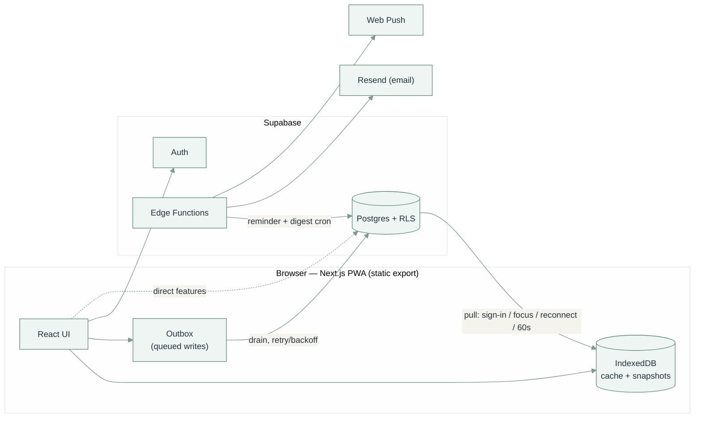

# Lauva

A personal health tracker: food, symptoms, supplements, habits, stool, workouts, cycle and coffee, plus dashboards to make sense of it. Live at **[lauva.pl](https://lauva.pl)**.

- Works fully offline, syncs to Supabase once you sign in
- Installs as a PWA on iPhone and Android, and works as a normal desktop site
- Designed to feel like a native iOS 26 app

---

## Contents

- [Pages](#pages)
- [How logging works](#how-logging-works)
- [Tech stack](#tech-stack)
- [Running it locally](#running-it-locally)
- [Project structure](#project-structure)
- [Architecture at a glance](#architecture-at-a-glance)
- [CI and deployment](#ci-and-deployment)
- [Maintainer notes](#maintainer-notes)
- [Further docs](#further-docs)

---

## Pages

Five main areas, in the phone tab bar and the desktop sidebar. Messages appears only once a partner is linked.

| Area | Route | What it's for |
|---|---|---|
| **Log** | `/log` | Tap-to-log for every tracking domain, plus a Summary of the day |
| **Agenda** | `/agenda` | One urgency-sorted list: reminders, expiring products, doctor follow-ups, appointments |
| **Trends** | `/analytics` | A dashboard per Log domain, plus Patterns |
| **Health** | `/medical` | Visits, lab Results, Vitals, Doctors |
| **Notes** | `/personal` | Journal, Wishlist, shared discount Codes |
| **Messages** | `/notes` | Private messages with a linked partner |

Secondary pages:

| Page | Route | Where it lives |
|---|---|---|
| Settings | `/manage` | Sidebar foot / phone menu. Every editable list and option in the app |
| Help | `/help` | Sidebar foot / phone menu. Searchable plain-language reference |
| Google Drive | `/my-drive` | Account menu. Read-only Drive browser |

Old routes redirect: `/overview` → `/agenda`, `/doctors` → `/medical`, `/home` → `/personal`.

### Log

Tabs: **Food · Symptoms · Supplements · Habits · Stool · Workout · Cycle · Coffee · Summary**

- **Toolbar:** search (or add), meal / time of day, time. On desktop it sits beside the page title.
- **Categories:** a scrolling category rail on a phone; a sidebar with per-category logged counts on desktop. Items are A–Z, in as many columns as fit on desktop.
- **Food's current meal** shows above the list as removable chips ("Dinner · 3"). "Copy to…" logs the same items under another meal or day.
- **Food extras:**
  - "Usual" tab: what you log most at the chosen meal
  - "Sep picks" tab: in-season foods you haven't eaten lately
  - Products: log a whole product's ingredients in one tap
- **Workout:** a Log / Plan switch, with Charts (Trends → Workout) and Manage beside it. Log lists every exercise by category with a `− value +` stepper (drag or tap the number for fine steps) and a Log button. Plan shows the day's targets from your active workout plans, with an iOS-style week row (done, missed or short per day). Logging a plan set writes an ordinary workout log.
- **Coffee:** grouped by brand. Tapping a coffee opens a per-cup form (café, price, brewing, water temp, tasting notes).
- **Deep link:** `/log/?tab=workout` (any tab name) opens Log on that tab. Settings → Workout and Workout plans link back this way.
- **Summary:** the day's meals with their notes, then everything logged, grouped by hour. Tap an entry to edit it or delete it.

### Health

| Tab | Contents |
|---|---|
| Visits | "Before your next visit" (upcoming dates and open notes/decisions) and "Past visits" |
| Results | Every lab marker on a reference-range bar. Tap one for its trend chart and history |
| Vitals | Blood pressure and weight, ACC/AHA categories, optional weight-goal band |
| Doctors | Read-only directory; editing is in Settings |

### Settings

A grouped list (Tracking, Health, Lists, App) where each row opens its own screen. From here you can:

- Add, rename, archive or delete items and categories, including a category icon and colour (every built-in category starts with its own icon; a new one gets its tab's icon until you pick one)
- Pick icons and colours for anything that has them (categories, wishlist and reminder lists, doctor types, lab panels):
  - ~1,900 searchable icons: Lauva's own plus the full [Lucide](https://lucide.dev) set
  - Any colour via + (system colour picker); it's saved to **Your colours** and offered in every other picker; in dark mode a very dark pick is lightened just enough to stay visible
- Edit products, reminder lists, wishlist lists, lab markers and panels, doctors and doctor types
- Edit the Stool and Coffee option chips, and the coffee currency
- Build weekly workout plans: lifts, each with a starting weight and its own weekly gain, and which days get +kg or % of that week's base
- Show or hide tracked sections, each with an optional daily "remind me to log" time
- Export your data as JSON (whole account) or CSV (one section or everything)

---

## How logging works

- **Tap-only.** No forms on the tracking tabs: pick a category, tap an item.
- **Symptoms** cycle through intensity 1 → 2 → 3 → clear. **Sleep** takes a band (`<5h` … `9h+`).
- **A logged item** gets a filled circle with a tick (Reminders-style); a symptom's circle shows its level.
- **The day rolls over at 3 AM.** Anything logged before 3 AM counts toward the previous day.
- **The meal is auto-picked by time:** Breakfast before noon, Lunch before 6pm, Dinner after that.
- **Time is editable** per entry, and the date stepper opens a calendar.
- **"Not logged" never means "didn't happen".** Empty days are left out of percentages, not counted as zero.
- **Cycle** stores only period days. Cycle length and predictions are always derived, never stored.
- **Hiding a section** in Settings hides it from both Log and Trends, on that device only.

---

## Tech stack

| | |
|---|---|
| Framework | Next.js 16 (App Router, static export), React 19, TypeScript |
| Styling | Tailwind CSS 4, design tokens in `src/app/globals.css` |
| Backend | Supabase: Postgres, Auth, Row-Level Security, Edge Functions |
| Local store | IndexedDB (`idb`), a cache plus an offline write queue |
| Libraries | Recharts, react-markdown + remark-gfm, jszip |
| Tests | Vitest (+ `fake-indexeddb`, jsdom for components) |

---

## Running it locally

Needs **Node 24** (see `.nvmrc`).

```bash
npm install
npm run dev
```

Logging works straight away with no account. To sync across devices:

1. Create a Supabase project
2. Run [`supabase/schema.sql`](supabase/schema.sql) in its SQL editor
3. Copy `.env.local.example` to `.env.local` and fill it in
4. Sign in from the account menu

### Environment variables

All optional. Without them the app runs local-only.

| Variable | Enables |
|---|---|
| `NEXT_PUBLIC_SUPABASE_URL`, `NEXT_PUBLIC_SUPABASE_ANON_KEY` | Sync and sign-in |
| `NEXT_PUBLIC_VAPID_PUBLIC_KEY` | Push notifications (also needs `VAPID_PRIVATE_KEY` as a Supabase secret) |
| `NEXT_PUBLIC_GOOGLE_CLIENT_ID` | Google Drive |

### Commands

```bash
npm run dev         # dev server on :3000
npm run lint        # eslint
npm run typecheck   # tsc --noEmit
npm run test        # vitest
npm run build       # production build (also type-checks)
```

---

## Project structure

```
src/
  app/                one folder per page (App Router)
  components/         UI — ui/ holds the shared primitives
  lib/
    aggregations/     dashboard calculations, one module per dashboard
    db/indexedDb.ts   local cache, snapshots, write lock
    supabase/         client, sync, outbox, direct writes
    canonical/        items + logs → the shape dashboards read
  taxonomy/           categories, food classification, naming rules
supabase/
  schema.sql          full schema + RLS: the source of truth
  functions/          Edge Functions (cron, push, email, link titles, phone share)
  tests/rls.test.sql  RLS isolation tests (run in CI)
docs/
  architecture.md     sync, offline, data shapes, cron, email
  data-model.md       schema map with ER diagrams
  design-system.md    tokens, type scale, shared UI primitives
```

---

## Architecture at a glance



- **Supabase is the source of truth.** IndexedDB is only a cache.
- **Writes are local-first.** Each write lands in IndexedDB, then an outbox pushes it with retry.
- **Pulls happen** on sign-in, tab focus, reconnect and every 60 s. Unsynced writes are replayed on top, so they never vanish.
- **Every query filters by `user_id`,** and every foreign key between user tables is a composite `(user_id, id)`.
- **Sync problems are visible:** `SyncStatusBanner` for stuck writes, `StorageErrorBanner` for local storage failures.

Full detail: **[docs/architecture.md](docs/architecture.md)**.

---

## CI and deployment

| What | How |
|---|---|
| Checks | `check.yml`: lint, typecheck, test and build on every push, plus an RLS test job against a throwaway Postgres |
| App deploy | Push to `main` → `deploy.yml` → GitHub Pages at `lauva.pl`. **A push to `main` is a deploy.** |
| Edge Functions | `deploy-functions.yml` runs when `supabase/functions/` changes, and syncs their secrets |
| Version | Footer shows `v<major.minor>.<commit count>`, the commit hash and its date |

---

## Maintainer notes

- **Styling:** use the tokens (`var(--…)`) and the shared primitives in `src/components/ui/`. See [docs/design-system.md](docs/design-system.md).
- **Icons:** `public/icons/` are renders of `public/logo-mark.svg`. Regenerate them, don't hand-edit.
- **Password reset:** `https://lauva.pl/reset/` and `http://localhost:3000/reset/` must be listed in Supabase → Auth → Redirect URLs.
- **Google Drive:** needs an OAuth web client with `http://localhost:3000` authorized, the `drive.metadata.readonly` and `drive.file` scopes, and the Drive API enabled.
- **Email:** needs a verified Resend domain. See [docs/architecture.md](docs/architecture.md#email).
- **One partner per account,** by design. There's no in-app unlink yet.
- **Not in git:** `.next/`, `out/`, `data/`, `.claude/`.

---

## Further docs

| Doc | Covers |
|---|---|
| [docs/architecture.md](docs/architecture.md) | Sync, offline writes, data shapes, direct-to-Supabase features, PWA, cron, email |
| [docs/data-model.md](docs/data-model.md) | The database schema, with ER diagrams |
| [docs/design-system.md](docs/design-system.md) | Colours, type, and the shared UI components |

---

## License

All rights reserved. See [LICENSE](LICENSE). The source is visible for reference, not for reuse.
