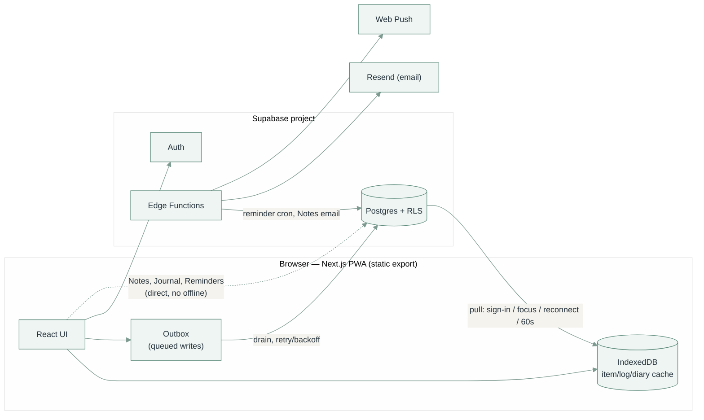

# Lauva

A personal food, symptom, supplement, habit, workout, and cycle tracker, with a dashboard for making sense of it afterwards. Live at [lauva.pl](https://lauva.pl).

## What it does

- **Overview** (`/overview`) — the home/at-a-glance page: Today (a chronological story of today plus a one-line recap of yesterday, across Food/Workout/Symptoms/Cycle/Notes), Recent Activity, Personal Trends (short cross-domain drift + "what stands out" facts, no charts), a monthly Calendar with a dot per active domain per day (tap a day for its story), Partner Notes, a Weekly/Monthly Review of totals, and a filterable Lauva Timeline. Everything here reads data Log/Food/Workout/Cycle/Notes already own — nothing is computed twice.
- **Log** (`/log`) — tap-to-log entry for Food, Symptoms, Supplements, Habits, Stool, Workout, Cycle, and Journal. No forms; pick a category, tap the item. Food and Supplements support multi-tapping with a tag (meal for Food, morning/afternoon/night for Supplements); every log type has a Time field so you can log something at 9pm that actually happened at 10am. Cycle tracks period days (intensity, collection method) on a calendar, with next-period predictions and cycle-length stats computed from your own recorded history, not a fixed assumed cycle length. Journal is a plain freeform diary — a date, an optional title, and a body, listed and searchable, with no mood/tag structure imposed on it. Any tab you don't use (e.g. Cycle) can be hidden from Manage — it disappears from Log and its analytics page both (Journal is always on, since it's not a tracked health domain). Unlike Overview's Recent Activity/Timeline (understanding what happened), Log's own day timeline is for managing records — editing, deleting, correcting a tag.
- **Manage** (`/manage`) — add, rename, archive, or delete items and categories for all five item-backed types, set per-exercise units, and toggle which tracked domains show up in Log/analytics at all.
- **Food / Workout / Cycle dashboards** — charts and pattern analysis over what's been logged. Food additionally scores logged intake against a research-informed model and surfaces what's underrepresented, without diagnosing anything. Cycle's analytics (cycle-length/period-length trends, delay-vs-prediction) are separate from the Log page's Cycle tab, which just handles today's entry and a compact calendar.
- **My Drive** (`/my-drive`) — read-only browser for the signed-in Google account's own Google Drive.
- **Help** (`/help`) — a one-page plain-language reference for what each part of the app does.
- **Connect → Notes** (`/notes`) — private notes between two linked partner accounts, separate from personal logging. Link once with a short invite code (Manage-style — no invite emails), then send a note with a category (Note/Reminder/Appreciation/Question), reply to build a simple thread, favourite, mark read/unread, and archive. The recipient gets an email when a note or reply arrives.
- **Reminders → Personal** (`/reminders`) — private notes, one-off tasks with an optional deadline, and recurring tasks (cleaning, changing filters, taking out the rubbish) with a completion history. Completing a task sends an email (and a push notification, if enabled) the next time it's due; a recurring task's due date auto-advances and its full completion history is kept, not just the latest one.
- **Reminders → Home** (`/home`) — the same three concepts as Personal, shared with your linked partner (reuses the Connect pairing, see below): shared notes, shared tasks either of you can complete (and optionally assign to one of you), and a product **Expiration** tracker (add by text or voice, grouped into Expired / Expiring soon / Later) with the same email+push reminders. Every shared item shows who completed it and when.
- Works fully offline; syncs to Supabase when signed in; installable as a PWA.

Supplements, Habits, Digestion, and Patterns dashboards also exist and work, but aren't currently linked from the nav (`src/components/Nav.tsx`) while Food/Workout/Cycle get rebuilt first — nothing about them was removed, they're one nav entry away from coming back.

## Tech stack

- **Next.js 16** (App Router, static export — `output: "export"` in `next.config.ts`), React 19, TypeScript
- **Tailwind CSS 4**
- **Supabase** (Postgres + Auth + Row-Level Security + Edge Functions) as the only backend
- **IndexedDB** (via `idb`) as the local cache/offline store
- **Recharts** for charts, **Vitest** for tests

## Project structure

```
src/
  app/                  route pages (App Router) — one folder per page
  components/           UI components (ui/, charts/, auth/, log/, icons/, reminders/, home/)
  lib/
    aggregations/       per-page chart/stat computation, one module per dashboard
    db/indexedDb.ts     local cache: schema, CRUD, the write lock
    supabase/           Supabase client, sync (push+pull), outbox drain
    canonical/          turns items+logs into the shape dashboards read
  taxonomy/             category definitions, food classification, naming rules
supabase/
  schema.sql            full DDL + RLS policies — the source of truth for the data model
  functions/            Edge Functions (bug report email, reminder cron, Notes email)
  tests/rls.test.sql    automated RLS isolation tests (CI only, never a real project)
docs/
  data-model.md         readable map of the schema — grouped ER diagrams, RLS shapes
  palette.svg           brand palette reference
```

## Running it locally

Needs Node 24 (see `.nvmrc`).

```bash
npm install
npm run dev
```

Logging works fully offline out of the box — everything is cached in the browser via IndexedDB. To sync across devices, set up a free Supabase project, run [`supabase/schema.sql`](supabase/schema.sql) in its SQL editor, copy `.env.local.example` to `.env.local`, fill in the URL and anon key, then sign in from the account menu.

## Environment variables

All optional — without them the app just runs local-only with fewer features. See `.env.local.example` for the full list with explanations:

| Variable | Enables |
|---|---|
| `NEXT_PUBLIC_SUPABASE_URL` / `NEXT_PUBLIC_SUPABASE_ANON_KEY` | Cloud sync and sign-in |
| `NEXT_PUBLIC_VAPID_PUBLIC_KEY` | Reminder push notifications (also needs `VAPID_PRIVATE_KEY` as a Supabase secret) |
| `NEXT_PUBLIC_GOOGLE_CLIENT_ID` | My Drive (Google Drive browsing) |

## Architecture



**Supabase is the only source of truth; IndexedDB is a synced cache.** IndexedDB is wiped and repopulated from Supabase on sign-in, whenever the tab regains focus, on reconnect, and on a 60-second timer while the tab is visible — so a change made on another device shows up here within about a minute without needing to background/refocus this tab first. Every pull filters `.eq("user_id", ...)` explicitly rather than trusting RLS alone to scope rows — belt-and-suspenders after a real incident where a table's RLS was live but a retrofitted `enable row level security` migration hadn't actually been run against the deployed project, and rows briefly weren't scoped per account. Every write goes to IndexedDB first (so the UI never waits on the network) and is queued in a small outbox; a background drain sends queued writes to Supabase with retry/backoff, so nothing typed offline is lost. A write that's permanently rejected (not just offline) shows up in a banner (`src/components/SyncStatusBanner.tsx`) naming what failed and why, with a Retry button — the local record was never at risk, only its cloud copy is stuck; retrying (or auto-repairing) an item also retries any of its logs/notes that were only stuck waiting on it. A single write lock (`withDataLock` in `indexedDb.ts`) keeps a cloud pull from ever running in the middle of a local write.

**Items, logs, diary, categories** — one consistent shape across Food, Supplement, Habit, Symptom, and Workout: an *item* (what you track, with a category) has many *logs* (one per occurrence) and an optional *diary* entry per day (a note). Categories are shared per item type and editable from Manage; a type with no custom categories yet falls back to the built-in defaults in `src/taxonomy/categories.ts`, and once any real row exists the database is the only source of truth from then on. Archiving hides an item from Log without touching its history; deleting is only allowed once an item has zero logged history (every `*_logs`/`*_diary` foreign key is `on delete restrict`).

**Stool and Workout logs don't fit that shape and keep their own tables** (`stool_logs`, `workout_logs`) — a bowel movement or a lift isn't "an item plus an occurrence." Workout still gets a real item type (`workout_items`: name, category, archive state, a unit like kg/minutes/reps) for the Manage page and the Log page's per-exercise rows, and `workout_logs.item_id` is a real foreign key to it, same as every other log table — the app layer just keeps working with a plain exercise name, resolving to/from `item_id` only at the Supabase sync boundary (`buildWorkoutLogRow`/`pullFromCloud` in `sync.ts`).

**Cycle is the same standalone shape as Stool** (`period_logs`, one row per calendar day flagged as a period day — no item/category of its own) but nothing about cycle length, cycle day, or predictions is stored: `src/lib/aggregations/cycle.ts` derives all of it from the recorded dates on the fly (grouping consecutive dates into periods, then reading days-between-period-starts as cycle length), using a recent-cycles window rather than entire history so predictions track how the cycle actually behaves lately, not an average smoothed over years.

**Connect → Notes has no offline mode and isn't part of the IndexedDB sync system above** — a note only means anything once it reaches your partner's real account, so it talks to Supabase directly (`src/lib/supabase/notes.ts` / `partner.ts`) rather than going through the write-local-first outbox. Two accounts become "partners" by redeeming a short-lived invite code into a `partner_links` row (`redeem_partner_invite`, a `security definer` Postgres function — the only place in this schema one user's action creates a row naming a *different* user, so it needs to bypass RLS deliberately rather than relying on a policy); every note is then one row in `notes`, sender/recipient RLS-checked against that link on insert. A reply is just another `notes` row with `thread_root_id` pointing at the top-level note — no separate replies table — with a trigger (`notes_touch_thread`) keeping the thread's `last_message_at` and each side's own read timestamp current as messages arrive, which is what makes a thread go unread-again for the other person without a full chat-style read-receipt system. `supabase/functions/notify-note` emails whoever just received a note or reply — the one place this app needs a user's *email* rather than their id, which requires the service-role client (`SUPABASE_URL`/`SUPABASE_SERVICE_ROLE_KEY`, injected into every Edge Function automatically) since `auth.users` isn't queryable by a regular signed-in client at all. The email itself never includes the note's subject or body — only that something arrived — since email isn't a private channel the way the app is.

**Log → Journal is unrelated to the per-item diary notes above, despite how similar the two sound** — this is a personal freeform journal (`journal_entries`: date, optional title, body), not a note attached to a specific food/supplement/habit/symptom/workout entry. Like Notes, it has no offline mode and talks to Supabase directly (`src/lib/supabase/journal.ts`) rather than through the outbox, since an entry is written once in a sitting rather than logged repeatedly. It's always visible on the Log page regardless of Manage's hide/show toggles, since it isn't a tracked health domain.

**Reminders → Personal and Reminders → Home are deliberately separate tables with separate RLS, not one shared "reminders" schema with a flag** — Personal (`personal_notes`/`personal_tasks`/`personal_task_completions`) is owner-only, same `auth.uid() = user_id` policy shape as every item table; Home (`household_notes`/`household_tasks`/`household_task_completions`/`household_items`) reuses Connect's `partner_links` pairing instead of inventing a second one, via a small `is_household_member(target_user_id)` SQL helper that checks whether the caller is linked to that row's `owner_id` — so a Home row is visible/editable by its creator *and* their one linked partner, with no separate "share this" step. One `*_tasks` table covers both a one-off deadline and a recurring chore: `recurrence_days` null means one-off (`last_completed_at`, once set, means done); set means recurring (`due_at` is the *next* occurrence, advanced by `recurrence_days` every time it's completed, and the task is never permanently "done"). Every completion — personal or shared — also gets its own row in a `*_task_completions` table (not just the denormalized `last_completed_at`/`last_completed_by` on the task itself, which exists purely so the list view doesn't need a join), so a task's full completion history survives even though the UI currently only surfaces the latest one. Reminders reuse 100% of Connect/push infrastructure rather than adding new plumbing: `supabase/functions/breakfast-reminder-cron` (see Deployment below) gained a second phase that scans these tables for due, not-yet-reminded rows and sends both a push (existing `push_subscriptions` table) and an email (existing Resend account, same as `notify-note`) — `reminder_sent_at` is the sole idempotency guard, cleared automatically whenever a recurring task's `due_at` advances so the next occurrence reminds again. Voice input on the Expiration tracker is the browser's own Web Speech API (`src/lib/useSpeechToText.ts`), feature-detected — no server involvement, no new dependency, and simply absent on a browser that doesn't support it.

**Which domains show up is a local, per-device preference, not synced data.** `src/lib/visibleDomains.tsx` holds a `VisibleDomainsProvider` (localStorage-backed) that Log and Nav both read to hide a tracked type — and its analytics page — everywhere at once; deliberately not pushed to Supabase, since "I don't track this" is a statement about this device/person using the account, not a fact about the data itself.

**PWA / offline shell**: `public/manifest.webmanifest` + `public/sw.js` cache the app shell (HTML/JS/CSS) separately from IndexedDB's data cache. The service worker's cache name bakes in the deploy's git SHA, substituted by `.github/workflows/deploy.yml`, so every deploy is a genuinely new cache instead of accumulating old assets.

## Data model

Everything is stored in one Supabase (Postgres) project, one row per user,
scoped by row-level security. [`supabase/schema.sql`](supabase/schema.sql)
is the authoritative definition; **[`docs/data-model.md`](docs/data-model.md)
is the readable map** — grouped ER diagrams (tracked-domain core,
standalone logs, Connect, Reminders), the RLS policy shapes, and the
`security definer` functions.

The invariant worth knowing up front: every foreign key between user-owned
tables is a **composite key on `(user_id, id)`**, not `id` alone (category
FKs also carry `item_type`), so a row structurally can't reference another
user's data — or the wrong item type — regardless of RLS. Nothing about
the cycle is stored beyond flagged period days; length/day/predictions are
all derived at the app layer.

## Development commands

```bash
npm run dev        # local dev server
npm run lint        # eslint
npm run typecheck   # tsc --noEmit
npm run test         # vitest
npm run build        # production build (also type-checks)
```

`.github/workflows/check.yml` runs lint, typecheck, test, and build on every push/PR, plus a separate `rls` job that applies `schema.sql` to a throwaway Postgres container and runs [`supabase/tests/rls.test.sql`](supabase/tests/rls.test.sql) — automated proof that RLS actually stops one user from reading, writing, or referencing another's data, for every table. That only proves the schema file itself is correct, not that a live project's RLS is actually turned on — the app-side `npm run test` suite (`sync.test.ts`) separately covers the client's own `.eq("user_id", ...)` scoping, including a full sign-out/sign-in account switch.

## Deployment

Push to `main` → `.github/workflows/deploy.yml` builds and publishes to GitHub Pages at the domain in `public/CNAME`. No separate deploy step; a merge to `main` is the deploy.

Supabase Edge Functions (`supabase/functions/`) are deployed separately by `.github/workflows/deploy-functions.yml`, triggered whenever that folder changes. Their secrets (`SUPABASE_ACCESS_TOKEN`, `SUPABASE_PROJECT_REF`, plus whatever each function needs — `RESEND_API_KEY`/`BUG_EMAIL` for bug reports, `NOTES_FROM`/`REMINDERS_FROM` for the Notes and reminder emails, `VAPID_PRIVATE_KEY` for push) are pushed into Supabase's own secret store by that same workflow. One gotcha: changing a secret's *value* in GitHub doesn't retrigger the workflow (no file changed) — run it manually from the Actions tab, or the function keeps the old value.

**Email sending requires a verified Resend domain.** `notify-note` and the reminder cron send to a *user's* address (a partner, or whoever a task is for), not a fixed one. Resend's shared `onboarding@resend.dev` sender only delivers to the Resend account's own address, so those emails silently fail until you [verify a domain](https://resend.com/domains) (e.g. `lauva.pl`) and set `NOTES_FROM` / `REMINDERS_FROM` to an address on it (`Lauva <notes@lauva.pl>`). `report-bug` is unaffected — it mails `BUG_EMAIL`, the account owner. Both functions get `SUPABASE_URL`/`SUPABASE_SERVICE_ROLE_KEY` for free, the same way every Edge Function does.

Reminders run the same way, for the same reason nothing can run in the background on a static site: `supabase/functions/breakfast-reminder-cron` (still named after the check it started as, now general) is called every 15 minutes by Supabase's `pg_cron`/`pg_net` (setup SQL is in `schema.sql`, commented out). It checks every supplement/habit's `reminder_time` against the signed-in user's local time and sends a Web Push notification if it's passed and not yet logged today, and separately scans Personal/Home tasks (`due_at`) and Home's product Expiration items (`expires_on` minus their own `remind_days_before`) for anything due that hasn't been reminded yet, sending both a push and an email (reusing the same Resend account as `notify-note`) — see the Reminders paragraph under Architecture above for the idempotency/recurrence details.

## Notes for maintainers

- **Colors/branding**: CSS variables in `src/app/globals.css` (`--brand-*` is the true palette; everything else is a deepened, more legible version for text/charts). Light theme only, one typeface (Inter). `public/icons/` are PNG renders of `public/logo-mark.svg` — regenerate from the SVG if the mark changes, don't hand-edit the PNGs.

  
- **My Drive** uses [Google Identity Services' token client](https://developers.google.com/identity/oauth2/web/guides/use-token-model) (no backend, so no client secret) — the token is `drive.metadata.readonly`, lives in memory only, and never touches your Lauva/Supabase account. Signing out of Lauva also disconnects Drive, so a shared device never carries a Drive session over to whoever signs in next. To develop against it, create a Google Cloud OAuth client (Web application type), authorize `http://localhost:3000`, and enable the Drive API on that project.
- **Not in git**: `.next/`, `out/` (build output), `data/` (local raw export, never read by the app), `.claude/` (local editor/tooling scratch). See `.gitignore`.
- **Notes email sender name**: `notify-note` shows a `display_name` from the sender's Supabase auth metadata if set (Dashboard → Authentication → Users → the user → User Metadata), otherwise it derives a name from their email. `NOTES_FROM` / `REMINDERS_FROM` must be an address on a Resend-verified domain (see Deployment).
- **Connect assumes exactly one partner per account, and Home inherits that limit** — `redeem_partner_invite` rejects a redemption if either side is already linked to someone, and Home's sharing (`is_household_member`) is defined directly in terms of the same `partner_links` row. Unlinking (delete your own `partner_links` row) is supported so a mistaken pairing isn't permanent, but there's no "multiple partners" or "family" concept anywhere in the app, by design.

## License

All rights reserved — see [LICENSE](LICENSE). Source-visible for reference, not for reuse.
