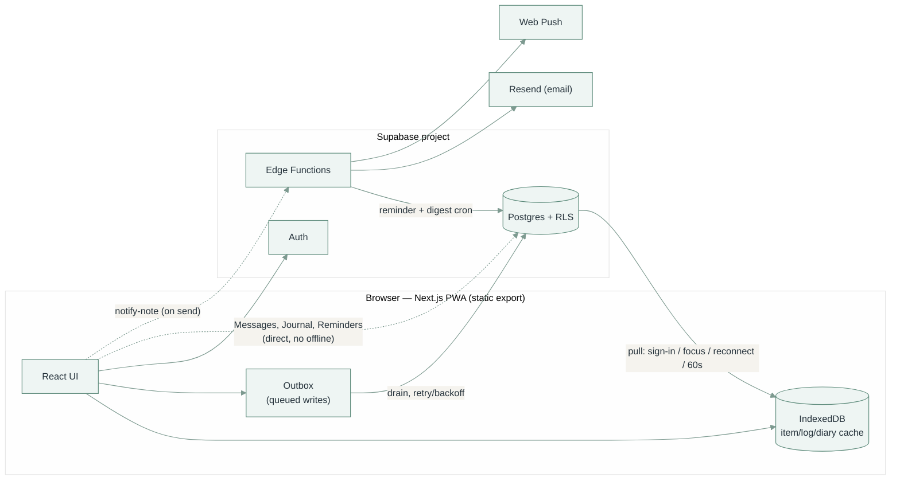
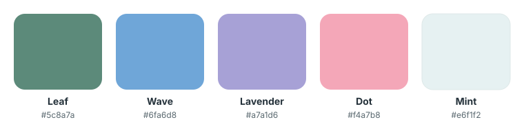

# Lauva

A personal tracker for food, symptoms, supplements, habits, workouts, and your
cycle — plus a set of dashboards for making sense of it all afterwards. Live at
[lauva.pl](https://lauva.pl).

It works fully offline, syncs to Supabase once you sign in, and installs as a PWA.

## Pages

| Page | Route | What it's for |
|---|---|---|
| **Overview** | `/overview` | The landing page. A cross-domain "needs attention" list grouped by urgency (overdue / today / tomorrow / next 7 days) — reminders, expiring products, doctor follow-ups and appointments — then today's story, a recent-activity feed, a few personal trends, and a weekly/monthly review. |
| **Log** | `/log` | Tap-to-log entry for the seven tracking domains: Food, Symptoms, Supplements, Habits, Stool, Workout, Cycle. |
| **Personal** | `/personal` | Journal, private notes, reminders, and product-expiry tracking — the "write once, come back to it" stuff. |
| **Medical** | `/medical` | Everything about doctor visits: a history log of appointments already attended (reusable doctors and specialties, per-doctor rating/language, follow-up notes and tasks, one next-appointment date per specialty), a **Care log** tab of dated observations tagged to the specialties they concern, a **Results** tab of blood/lab markers over time (one-off or whole-draw batch value entry), and a **Vitals** tab for blood pressure and weight with trend charts and ACC/AHA blood-pressure categories. `/doctors` redirects here. |
| **Analytics** | `/analytics` | One dashboard per domain (Food, Supplements, Habits, Digestion, Workout, Cycle, Patterns), switched by a tab bar, plus **Blood** — trends, flagged values and a compare overlay for the Medical → Results lab markers, and a summary of the latest blood pressure and weight from Vitals. |
| **Manage** | `/manage` | Add / rename / archive / delete items and categories, set exercise units, edit reminder lists and doctor types, hide domains you don't track, and export your data (whole account as JSON, or one section at a time as CSV). Searchable across every section. |
| **Household** | `/home` | The partner-facing versions of notes, reminders, and expiry, a shared list of discount codes, and a **Wishlist** of saved links grouped into lists — once you're linked, either of you can see and edit them. |
| **Messages** | `/notes` | Private one-to-one messaging with your linked partner. |
| **My Drive** | `/my-drive` | Read-only browser for the signed-in Google account's Drive. |
| **Help** | `/help` | Plain-language reference for what each part does. |

### Behaviour worth knowing

- **Logging is tap-only.** No forms on the tracking tabs — pick a category, tap the item. A symptom taps through intensity 1 → 2 → 3 → clear; Sleep taps a band (`<5h`…`9h+`).
- **The day rolls over at 3 AM, not midnight.** Anything logged between midnight and 3 AM counts as the previous day, with the time defaulting to 23:30.
- **Meals auto-pick by time of day** (Breakfast before noon, Lunch before 6pm, Dinner after — never Snack). The Food tab also pins a "Your usual" row of your most-logged foods.
- **Time is editable per entry** — the per-tab time control stays collapsed as a small "now · change" link (it opens on its own once you pick a past day), and the day stepper has a tap-a-date calendar, so you can log at 9pm something that happened at 10am.
- **Cycle stores only flagged period days.** Cycle length, cycle day, and next-period predictions are all derived on the fly from a recent-cycles window, never stored.
- **"Not logged" always means only that** — never "didn't happen". Days with nothing logged are excluded from every percentage, not counted as zero.
- **Hiding a domain from Manage** removes it from Log *and* its Analytics dashboard, on that device only (it's a local preference, not synced data). The Analytics **Blood** tab has no Log domain, so it's always shown.

## Tech stack

- **Next.js 16** — App Router, static export (`output: "export"`), React 19, TypeScript
- **Tailwind CSS 4**
- **Supabase** — Postgres + Auth + Row-Level Security + Edge Functions, the only backend
- **IndexedDB** (via `idb`) — the local cache / offline store
- **Recharts** for charts, **Vitest** for tests

## Running it locally

Needs Node 24 (see `.nvmrc`).

```bash
npm install
npm run dev
```

Logging works offline out of the box — everything is cached in the browser. To
sync across devices you need a Supabase project:

1. Create a free Supabase project.
2. Run [`supabase/schema.sql`](supabase/schema.sql) in its SQL editor.
3. Copy `.env.local.example` to `.env.local` and fill in the URL and anon key.
4. Sign in from the account menu.

### Environment variables

All optional — without them the app runs local-only with fewer features. Full
list with explanations in `.env.local.example`.

| Variable | Enables |
|---|---|
| `NEXT_PUBLIC_SUPABASE_URL` / `NEXT_PUBLIC_SUPABASE_ANON_KEY` | Cloud sync and sign-in |
| `NEXT_PUBLIC_VAPID_PUBLIC_KEY` | Push notifications — reminders and message arrivals (also needs `VAPID_PRIVATE_KEY` as a Supabase secret) |
| `NEXT_PUBLIC_GOOGLE_CLIENT_ID` | My Drive |

### Commands

```bash
npm run dev         # local dev server
npm run lint        # eslint
npm run typecheck   # tsc --noEmit
npm run test        # vitest
npm run build       # production build (also type-checks)
```

## Project structure

```
src/
  app/                route pages (App Router) — one folder per page
  components/         UI components (ui/, charts/, auth/, log/, analytics/, notes/, reminders/, home/)
  lib/
    aggregations/     per-dashboard chart/stat computation, one module each
    db/indexedDb.ts   local cache: schema, CRUD, the write lock
    supabase/         Supabase client, sync (push + pull), outbox drain
    canonical/        turns items + logs into the shape dashboards read
  taxonomy/           category definitions, food classification, naming rules
supabase/
  schema.sql          full DDL + RLS policies — the source of truth for the data model
  functions/          Edge Functions (bug-report email; reminder + digest cron; message-arrival push; wishlist link-title fetch; wishlist phone-share)
  tests/rls.test.sql  automated RLS isolation tests (CI only)
docs/
  data-model.md       readable map of the schema — grouped ER diagrams, RLS shapes
  palette.svg         brand palette reference
```

## Architecture



### Sync: Supabase is the source of truth, IndexedDB is a cache

- IndexedDB is wiped and repopulated from Supabase on sign-in, on tab focus, on
  reconnect, and on a 60-second timer while the tab is visible — so a change made
  on another device shows up here within about a minute.
- Every write goes to IndexedDB first (the UI never waits on the network) and is
  queued in a small outbox. A background drain pushes queued writes to Supabase
  with retry/backoff, so nothing typed offline is lost.
- Every pull also filters `.eq("user_id", …)` explicitly rather than trusting RLS
  alone — after a real incident where a table's RLS was live but a retrofitted
  migration hadn't actually run against the deployed project.
- A permanently rejected write (not just offline) surfaces in a banner
  (`SyncStatusBanner.tsx`) with a Retry button. The local record was never at
  risk — only its cloud copy is stuck.
- One write lock (`withDataLock` in `indexedDb.ts`) stops a cloud pull from ever
  landing in the middle of a local write.
- Manage → "Your data" exports straight from Supabase (`src/lib/exportData.ts`) —
  every owned row across the schema, paged, each table scoped by its own ownership
  column. JSON is the whole account in one file; the section picker downloads that
  section's tables as CSV. Signed-in only; partner messages are left out.

### Data shapes

**Items + logs + diary + categories** — one shape across Food, Supplement, Habit,
Symptom, and Workout. An *item* (what you track, with a category) has many *logs*
(one per occurrence) and an optional *diary* entry per day. A type with no custom
categories falls back to the built-in defaults in `taxonomy/categories.ts`; once
a real category row exists, the database wins from then on. Archiving hides an
item without touching its history; deleting is only allowed once it has zero
logged history (every `*_logs` / `*_diary` FK is `on delete restrict`).

**Stool and Workout** don't fit that shape and keep their own tables
(`stool_logs`, `workout_logs`) — a bowel movement or a lift isn't "an item plus
an occurrence". Workout still gets a `workout_items` row (for Manage and the
per-exercise Log rows) with `workout_logs.item_id` as a real FK; the app layer
works with a plain exercise name and resolves to/from `item_id` only at the sync
boundary.

**Cycle** (`period_logs`) is one row per calendar day flagged as a period day —
no item or category. Length, cycle day, and predictions are all derived in
`aggregations/cycle.ts` from a recent-cycles window, so they track how the cycle
behaves *lately* rather than an average smoothed over years.

**Every FK between user-owned tables is a composite key on `(user_id, id)`** (plus
`item_type` for category FKs), so a row structurally can't reference another
user's data regardless of RLS. `supabase/schema.sql` is authoritative;
[`docs/data-model.md`](docs/data-model.md) is the readable map.

### Direct-to-Supabase features (no offline mode)

Messages, the Personal page's Journal / Notes / Reminders / Expiration, and the
Medical page all talk to Supabase directly rather than through the
write-local-first outbox — they only mean anything once they're on the server.

- **Messages** (`notes` table) — two accounts become partners by redeeming a
  short-lived invite code into a `partner_links` row (`redeem_partner_invite`, a
  `security definer` function — the one place a user's action creates a row
  naming a *different* user). A reply is just another `notes` row with
  `thread_root_id` set; a trigger keeps the thread's `last_message_at` and each
  side's read timestamp current. Read state and archive are per-side; favourite
  is shared (the client writes both `sender_*` and `recipient_*` columns).
- **Personal vs Household** — `personal_notes` / `personal_tasks` / `personal_items`
  are owner-only; the `household_*` tables reuse the same `partner_links` pairing
  via an `is_household_member()` SQL helper, so a row is visible to its creator
  *and* their one linked partner with no "share this" step. Both sides reuse the
  exact same `NoteBoard` / `TaskBoard` / `ExpirationBoard` components, inside the
  same `BoardPage` shell (title rule + underlined tab bar). (The Household page
  labels its `TaskBoard` tab "Reminders" to match Personal; the table is still
  `household_tasks`.)
- **Shared codes** (`household_codes`, pair-visible) — discount/promo codes with a
  code, name, optional comment and optional `expires_on`. There's no cron: a code
  whose `expires_on` has passed is deleted client-side by `fetchHouseholdCodes`
  the next time either partner opens the list; codes with no date stay until
  removed.
- **Wishlist** (`wishlist_categories` + `wishlist_items`, pair-visible) — link
  lists grouped into user-named categories; an item is one URL plus a title, an
  optional note, and an optional "who it's for". The title is fetched from the
  page by the `fetch-link-metadata` Edge Function (the static client can't —
  CORS), falling back to a typed title. `wishlist_items.category_id` cascades on
  category delete. Each list can be given an icon and a colour from the category
  form (`wishlist_categories.icon` / `color`); left unset it falls back to a
  heart glyph and a position-keyed accent. On Android the PWA `share_target`
  (`/home/?url=…`) routes a shared link straight to a pre-filled new item; iOS
  has no share target, so the
  Wishlist tab's "Add from your phone" panel issues a per-account capture token
  (`wishlist_share_tokens`) for a Share Sheet shortcut that POSTs to the
  `wishlist-share` Edge Function — links land in a "Saved from phone" list.
- **Reminder lists** (`reminder_lists`, owner-only) — `personal_tasks.list_id` is
  a composite FK with `on delete set null`, so deleting a list drops its tasks
  back to the default bucket rather than removing them. Lists are managed on the
  Manage page, not the Reminders tab. Household reminders have no lists.
- **Tasks** — one `*_tasks` table covers both a one-off deadline and a recurring
  chore. `recurrence_days` null = one-off; set = recurring (`due_at` is the next
  occurrence, advanced on each completion). Every completion also writes a
  `*_task_completions` row; "Undo" drops the latest one. `reminder_sent_at` is
  the sole idempotency guard for notifications, cleared when `due_at` advances.
- **Medical** (`doctor_specialties` / `doctors` / `doctor_appointments` /
  `doctor_appointment_tasks`, owner-only — the page and route are `/medical`, but
  the code stays under `src/components/doctors/` + `src/lib/supabase/doctors.ts`
  and the tables keep their `doctor_` prefix; it's a historical name, not renamed
  to avoid churn) — a doctor carries its *current*
  specialty; each appointment freezes a copy of that specialty when it's logged,
  so correcting a doctor's specialty later never rewrites history. The one
  next-appointment date per specialty lives on `doctor_specialties`, not on any
  doctor or appointment. `doctor_specialties` is the picker list (built-in
  defaults in `src/lib/doctors.ts` until the user edits one, then the rows win);
  each row can be renamed, archived (`is_archived` — kept out of the picker,
  reversible, history keeps its frozen string), or deleted, all from Manage.
  Follow-up tasks may set an optional `reminder_at` that the reminder cron sends
  once (phase 2 below). The **Care log** tab (`care_entries` + the `care_entry_specialties`
  join) is a separate dated timeline of *observation* and *note* entries, each
  tagged to any number of specialties; a specialty's detail view lists the
  entries tagged to it as "to raise here".
- **Voice input on Expiration and Codes** is the browser's own Web Speech API, feature-detected — no server, no dependency.

### PWA shell

`public/manifest.webmanifest` + `public/sw.js` cache the app shell (HTML/JS/CSS)
separately from IndexedDB's data cache. The service worker's cache name bakes in
the deploy's git SHA (substituted by `deploy.yml`), so every deploy is a genuinely
new cache instead of accumulating stale assets.

## CI

`.github/workflows/check.yml` runs lint, typecheck, test, and build on every
push/PR. A separate `rls` job applies `schema.sql` to a throwaway Postgres
container and runs [`supabase/tests/rls.test.sql`](supabase/tests/rls.test.sql) —
automated proof that RLS stops one user reading, writing, or referencing
another's data, for every table. That only checks the schema *file*; the app-side
`sync.test.ts` separately covers the client's own `.eq("user_id", …)` scoping,
including a full sign-out / sign-in account switch.

## Deployment

- **The app**: push to `main` → `deploy.yml` builds and publishes to GitHub Pages
  at the domain in `public/CNAME`. A merge to `main` *is* the deploy.
- **Edge Functions** (`supabase/functions/`): deployed by `deploy-functions.yml`,
  triggered whenever that folder changes. That same workflow pushes their secrets
  into Supabase's secret store — but only ones that actually have a value, so an
  unset GitHub secret can't wipe one set by hand in the dashboard. Changing a
  secret's *value* in GitHub doesn't retrigger the workflow (no file changed) —
  run it manually from the Actions tab.

### The reminder / digest cron

Nothing can run in the background on a static site, so `reminder-cron` is called
every 15 minutes by Supabase's `pg_cron` / `pg_net` (setup SQL is in
`schema.sql`, commented out). Three phases:

1. Each supplement/habit's `reminder_time` vs the user's local time → a push if
   it's passed and not logged today.
2. Due tasks (`personal_tasks` / `household_tasks`), due expiry items
   (`personal_items` / `household_items`, `expires_on` minus `remind_days_before`),
   and doctor follow-up tasks with a `reminder_at` that has passed → push + email.
3. After 09:00 Europe/Warsaw, one "N unread messages from …" email + push per
   linked user, at most once a day (`notes_digest_state`).

Sending a message also fires an immediate push to the recipient via the
`notify-note` function — the client invokes it fire-and-forget right after the
row saves (`src/lib/supabase/notes.ts`). Push only, no per-message email, and no
content in the payload — just "*X* sent you a message", tapping through to the
thread. The daily digest above is the fallback for anyone without push enabled.

A second, independent `pg_cron` job (`cron-job-run-details-cleanup`, setup SQL
in `schema.sql`) trims `cron.job_run_details` to the last 7 days so pg_cron's
own run history doesn't grow without bound. It touches nothing else.

### Email

Sending needs a **verified Resend domain**. The cron mails a *user's* address (a
partner, or whoever a task is for), and Resend's shared `onboarding@resend.dev`
sender only delivers to the Resend account owner — so those emails silently fail
until you [verify a domain](https://resend.com/domains) and set `NOTES_FROM` /
`REMINDERS_FROM` to an address on it (e.g. `Lauva <notes@lauva.pl>`). The
bug-report function is unaffected — it mails `BUG_EMAIL`, the account owner.

## Notes for maintainers

- **Colours / branding** — CSS variables in `src/app/globals.css`. `--brand-*` is
  the true palette; everything else is a deepened, more legible version for text
  and charts. Light theme only, one typeface (Inter). `public/icons/` are PNG
  renders of `public/logo-mark.svg` — regenerate from the SVG, don't hand-edit
  the PNGs.

  

- **My Drive** uses [Google Identity Services' token client](https://developers.google.com/identity/oauth2/web/guides/use-token-model)
  — no backend, so no client secret. The token is `drive.metadata.readonly`,
  lives in memory only, and never touches the Lauva/Supabase account. Signing out
  of Lauva also disconnects Drive. To develop against it: create a Google Cloud
  OAuth client (Web application type), authorize `http://localhost:3000`, and
  enable the Drive API.

- **Password reset** — the login panel's "forgot your password?" sends a Supabase
  reset email that lands on `/reset`, where the user picks a new password. The
  link only works if `https://lauva.pl/reset/` (and `http://localhost:3000/reset/`
  for local dev) is listed under the Supabase project's Auth → URL Configuration →
  Redirect URLs.

- **One partner per account** — `redeem_partner_invite` rejects a redemption if
  either side is already linked, and the Household page's `is_household_member()`
  helper is defined directly in terms of the same `partner_links` row. There's no
  "multiple partners" or "family" concept anywhere, by design. Unlinking has no
  in-app control yet — RLS lets either participant `DELETE` their `partner_links`
  row directly.

- **Digest sender name** — the digest says "N unread messages from *X*", where
  *X* is a `display_name` from the partner's Supabase auth metadata if set
  (Dashboard → Authentication → Users → User Metadata), otherwise a name derived
  from their email.

- **Not in git** — `.next/`, `out/` (build output), `data/` (local raw export,
  never read by the app), `.claude/` (local tooling scratch). See `.gitignore`.

## License

All rights reserved — see [LICENSE](LICENSE). Source-visible for reference, not
for reuse.
