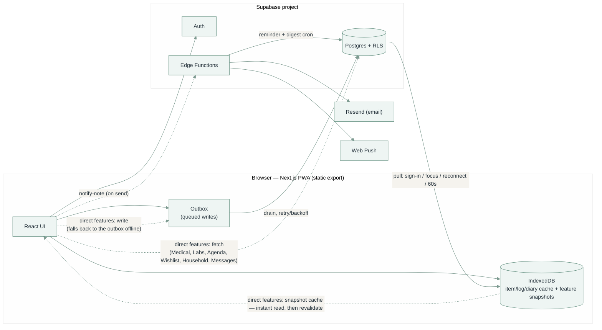

# Lauva

A personal tracker for food, symptoms, supplements, habits, workouts, your
cycle, and coffee — plus a set of dashboards for making sense of it all
afterwards. Live at [lauva.pl](https://lauva.pl).

It works fully offline, syncs to Supabase once you sign in, and installs as a PWA.

## Pages

The primary navigation is mid-restructure into five areas — **Log · Agenda · Trends ·
Health · Notes** — plus **Messages** as a 6th item, shown only once a partner is linked.
Desktop has a collapsible left sidebar; mobile has a flat bottom tab bar (the five
areas) and no top bar — each screen opens with a large title, and a menu button at
its trailing edge opens the drawer (Settings, Help, My Drive, account, Messages).
Within a screen, the page-level view switcher is a segmented control
(`SegmentedTabs`; domains past the edge fold into "More"); section switchers one
level down stay on the underlined `TabRail`.
Most routes still carry their original names and render their pre-restructure content;
the exceptions are Agenda (moved to `/agenda`, `/overview` redirects), the reminder /
product-expiry boards (moved to Agenda), and the old Household page (`/home`), whose
shared notes, codes and wishlist folded into the Notes area — `/home` redirects to
`/personal`. Settings (was Manage) and Help sit at the foot of the sidebar / mobile
drawer, above Report a bug; Google Drive stays in the account menu.

| Area | Route | What it's for |
|---|---|---|
| **Log** | `/log` | Tap-to-log entry for the eight tracking domains (searching a name that isn't tracked offers to add it): Food, Symptoms, Supplements, Habits, Stool, Workout, Cycle, Coffee. Food, Symptoms, Supplements and Habits share one layout: search, meal/time-of-day and time on a single row, then the categories as one grouped list of tappable rows (collapsible on mobile; short Symptoms/Supplements/Habits lists stay open; a column grid from `lg` up). Food replaces the collapsible list with a scrolling category strip and one list below it for the selected category (list rows on phones, a 3–4 column grid from `lg` up), most-used items first with the rest behind "All N" (searching shows grouped results instead), with a first "Usual" tab of what you log most at the selected meal, and today's meals (with their notes) under the list. Food also adds a "Products" row above it — a saved product (e.g. a bought smoothie) logs every one of its ingredients at once. Searching a name that isn't tracked can also add it as a product right there — name, optional brand and ingredients (any not yet tracked are created) — and logs it straight away; search matches saved products too. Coffee is grouped by brand: searching a new name adds it with an optional brand and notes, and tapping any coffee opens a per-cup form (café, price, brewing type/method, water temp, tasting characteristics). |
| **Agenda** | `/agenda` | The landing page, and nothing but the list: one urgency-first view that answers "what needs my attention?" — reminders (mine + shared), expiring products, doctor follow-ups and appointments, interleaved by *when they matter* into Overdue / Today / Tomorrow / Next 7 days / Later / No date / Done. Type, scope and list are filter chips, never the grouping. `/overview` redirects here. |
| **Trends** | `/analytics` | One dashboard per Log domain — Food, Supplements, Habits, Digestion (the Stool domain), Workout, Cycle — plus **Patterns**, switched by a tab bar. Food, Supplements and Habits are the "did I do it" domains: Habits and Supplements share a card grid (`AdherenceCardGrid`) with a month calendar or a 12-month bar per item; Food has its own section switcher. (Blood/lab analysis moved to Health → Results; `/analytics#labs` redirects there.) |
| **Health** | `/medical` | Four tabs — Visits (appointments + a running list of things to raise before the next one), Results (lab marker trends), Vitals (blood pressure and weight), Doctors (read-only directory; editing lives in Settings). Tab-by-tab detail below. `/doctors` redirects here; old tab hashes (`#appointments`, `#carelog`, `#followups`, `#specialties`) land on Visits. |
| **Notes** | `/personal` | Things you keep, no deadline — three tabs: **Journal** (private dated writing in Markdown — a grouped list under month headers like iOS Notes, a formatting toolbar and a preview switch in the editor, entries opened as formatted text), **Wishlist** (saved links grouped into lists; the lists themselves are managed in Settings), **Codes** (shared discount codes). `/home` redirects here. (Reminders and product-expiry moved to Agenda.) |
| **Messages** | `/notes` | Primary nav, partner-linked only — a link in the sidebar / mobile menu drawer (a dot on the menu button carries the unread cue), never the bottom bar. Private one-to-one messaging with your linked partner: folders (Inbox, Sent, Favourites, Archived) as text tabs, threads as grouped rows, and an open thread as iMessage-style bubbles with a reply bar. Sent shows a message in bold until your partner has read it. |
| Settings | `/manage` | (Sidebar foot.) A grouped list — Tracking, Health, Lists, App — where each row opens its own screen (the back gesture returns to the list). Long item lists are grouped by category, and tapping an item opens its fields (rename, category, unit, reminder, archive, delete) inline. Add / rename / archive / delete items and categories, give a category its own icon/colour, set exercise units, correct a food's automatic nutrition-group classification, define food products (name, brand, ingredient list — logged as a unit on Log → Food), edit reminder lists, wishlist lists (name/icon/colour), the Vitals weight goal, lab markers and panels (ranges, units, grouping, icons/colours), doctors (name/rating/language/notes/specialty), doctor types, the Stool tab's colour/symptom/floatation/characteristic chips, and Coffee's brewing type/method/characteristic chips and currency (edit, hide or — if never logged — delete existing coffees here too; new ones are added from Log → Coffee, which adds the coffee only, and tapping it then opens the per-cup form), show or hide tracked sections (they otherwise appear once they have data) and set a daily "remind me to log this" time per section, and export your data (whole account as JSON, or a section — or everything — as CSV in one file). Searchable across every section. Also linked from Log's inline "add item". |
| Google Drive | `/my-drive` | (Account menu.) Read-only browser for the signed-in Google account's Drive. |
| Help | `/help` | (Sidebar foot.) Plain-language reference for what each part does — grouped, collapsed, with a search box that filters entries. |

### Health, tab by tab

- **Visits** — two sections: "Before your next visit" (upcoming appointment dates, plus the dated observations/notes/decisions waiting for a visit — grouped decisions-and-notes-first then observations so the most-logged kind doesn't bury the rest, filterable by specialty) and "Past visits" (appointments already attended — reason, follow-up notes and a separate comments field, the latter two in Markdown — each with its follow-up tasks inline).
- **Results** — an Overview that is the marker list: every marker on a reference-range bar with the optimal band marked, grouped by panel or sorted A–Z, a panel filter (chips that scroll sideways), and a time-window control (All / 5y / 2y / 1y) that switches each bar between the window average (drawn as a whisker) and the latest reading. On desktop (`lg`+) the list stays in a left rail with the selected marker's detail beside it; on mobile, tapping a marker replaces the list with its detail: a trend chart (a real time axis, labels turned vertical when tight), window stats (latest, previous, change, average, spread, draw count), and full value history — where you also add or edit values (a single reading or a whole-draw batch). A new marker gets a slim quick-add here; markers and panels themselves (ranges, renames, icons/colours, grouping, delete) are managed in Settings. An optional optimal range, tighter than the lab reference range, is read first — a result inside the lab range but below target reads "below optimal" rather than "below norm". Absorbed the old Trends → Blood dashboard.
- **Vitals** — blood pressure and weight with trend charts (a 1m / 3m / 6m / 1y / All window that pins the x-axis so sparse readings still show every month/year) and ACC/AHA categories, plus an optional weight-goal band (set in Settings, shown read-only here).
- **Doctors** — read-only: picking a doctor shows their rating/language/specialty/notes and visit history, in place on mobile or a side pane on desktop. All doctor editing (name, rating, language, specialty, notes, add, delete) and doctor-type rename/archive live in Settings.

### Behaviour worth knowing

- **Logging is tap-only.** No forms on the tracking tabs — pick a category, tap the item. Food's categories are an accordion (opening one closes the others), so the page stays about one category tall. A symptom taps through intensity 1 → 2 → 3 → clear; Sleep taps a band (`<5h`…`9h+`).
- **The day rolls over at 3 AM, not midnight.** Anything logged between midnight and 3 AM counts as the previous day, with the time defaulting to 23:30.
- **Meals auto-pick by time of day** (Breakfast before noon, Lunch before 6pm, Dinner after — never Snack). The Food tab also pins a "Your usual" row of your most-logged foods, and a "Products" row once any exist (defined in Settings, or added from Log's search) — tapping one logs every one of its ingredients for the current meal in one go, and the day's per-meal box shows each with its product in parentheses, e.g. "Spirulina Powder (Green smoothie)".
- **Time is editable per entry** — the per-tab time control stays collapsed as a small "now · change" link (it opens on its own once you pick a past day), and the day stepper has a tap-a-date calendar, so you can log at 9pm something that happened at 10am.
- **Cycle stores only flagged period days.** Cycle length, cycle day, and next-period predictions are all derived on the fly from a recent-cycles window, never stored.
- **"Not logged" always means only that** — never "didn't happen". Days with nothing logged are excluded from every percentage, not counted as zero.
- **Hiding a domain from Settings** removes it from Log *and* its Trends dashboard, on that device only (it's a local preference, not synced data). Every Trends tab mirrors a Log domain now, so there's nothing that ignores the toggle.

## Tech stack

- **Next.js 16** — App Router, static export (`output: "export"`), React 19, TypeScript
- **Tailwind CSS 4**
- **Supabase** — Postgres + Auth + Row-Level Security + Edge Functions, the only backend
- **IndexedDB** (via `idb`) — the local cache / offline store
- **Recharts** for charts, **react-markdown** + **remark-gfm** for Journal entries, **jszip** for the CSV export bundle, **Vitest** for tests

## Running it locally

Needs Node 24 (see `.nvmrc`).

```bash
npm install
npm run dev
```

Logging works offline out of the box — everything is cached in the browser. To
sync across devices you need a Supabase project:

1. Create a free Supabase project.
2. Run [`supabase/schema.sql`](supabase/schema.sql) in its SQL editor.
3. Copy `.env.local.example` to `.env.local` and fill in the URL and anon key.
4. Sign in from the account menu.

### Environment variables

All optional — without them the app runs local-only with fewer features. Full
list with explanations in `.env.local.example`.

| Variable | Enables |
|---|---|
| `NEXT_PUBLIC_SUPABASE_URL` / `NEXT_PUBLIC_SUPABASE_ANON_KEY` | Cloud sync and sign-in |
| `NEXT_PUBLIC_VAPID_PUBLIC_KEY` | Push notifications — reminders and message arrivals (also needs `VAPID_PRIVATE_KEY` as a Supabase secret) |
| `NEXT_PUBLIC_GOOGLE_CLIENT_ID` | My Drive |

### Commands

```bash
npm run dev         # local dev server
npm run lint        # eslint
npm run typecheck   # tsc --noEmit
npm run test        # vitest
npm run build       # production build (also type-checks)
```

## Project structure

```
src/
  app/                route pages (App Router) — one folder per page
  components/         UI components (ui/, charts/, auth/, log/, analytics/, notes/, reminders/, home/)
  lib/
    aggregations/     per-dashboard chart/stat computation, one module each
    db/indexedDb.ts   local cache: schema, CRUD, the write lock
    supabase/         Supabase client, sync (push + pull), outbox drain
    canonical/        turns items + logs into the shape dashboards read
  taxonomy/           category definitions, food classification, naming rules
supabase/
  schema.sql          full DDL + RLS policies — the source of truth for the data model
  functions/          Edge Functions (bug-report email; reminder + digest cron; message-arrival push; wishlist link-title fetch; wishlist phone-share)
  tests/rls.test.sql  automated RLS isolation tests (CI only)
docs/
  data-model.md       readable map of the schema — grouped ER diagrams, RLS shapes
  palette.svg         brand palette reference
```

## Architecture



### Sync: Supabase is the source of truth, IndexedDB is a cache

- IndexedDB is wiped and repopulated from Supabase on sign-in, on tab focus, on
  reconnect, and on a 60-second timer while the tab is visible — so a change made
  on another device shows up here within about a minute. Changes still waiting in
  the outbox are re-applied on top of the fresh copy, so an unsynced entry never
  disappears from the screen.
- Every write goes to IndexedDB first (the UI never waits on the network) and is
  queued in a small outbox. A background drain pushes queued writes to Supabase
  with retry/backoff, so nothing typed offline is lost.
- Every pull also filters `.eq("user_id", …)` explicitly rather than trusting RLS
  alone — after a real incident where a table's RLS was live but a retrofitted
  migration hadn't actually run against the deployed project.
- A banner (`SyncStatusBanner.tsx`) makes outbox state visible instead of
  silent. A pending count (with Retry now, which skips the backoff wait) expands
  into every queued change: what it is (item, day, meal — `describeOutboxEntry.ts`),
  when it was saved on this device, and how many sends were tried, one "Latest
  problem" line with the most recent error, plus a "Save a copy as a file"
  download of the unsent data. A refused login token (`PGRST301`–`303`) makes the
  drain refresh the session once and resend. A permanently rejected write shows
  which record, why, and Retry/Discard buttons. The local record is never at
  risk either way — only the cloud copy is stuck.
- `StorageErrorBanner.tsx` covers the other failure: a local save that IndexedDB
  itself rejects (device out of space, browser blocking site data). `indexedDb.ts`
  announces those and the banner tells the user their last change may not have
  been kept; the error still reaches the caller.
- Stored data is checked when it's read back. A server row missing its id, date
  or name is skipped during a pull rather than half-installed; an outbox entry
  with no usable payload is moved to the failed list instead of being sent; a
  snapshot that doesn't match its envelope, or that its hook can't apply, is
  dropped and refetched. None of this touches Supabase — only the local cache.
- One write lock (`withDataLock` in `indexedDb.ts`) stops a cloud pull from ever
  landing in the middle of a local write.
- Manage → "Your data" exports straight from Supabase (`src/lib/exportData.ts`) —
  every owned row across the schema, paged, each table scoped by its own ownership
  column. JSON is the whole account in one file; the section picker ("Everything"
  or one section) downloads its tables as CSV — a single `.csv` for a one-table
  section, a `.zip` (via `jszip`) when there's more than one. Signed-in only;
  partner messages are left out.

### Data shapes

**Items + logs + diary + categories** — one shape across Food, Supplement, Habit,
Symptom, and Workout. An *item* (what you track, with a category) has many *logs*
(one per occurrence) and an optional *diary* entry per day. A type with no custom
categories falls back to the built-in defaults in `taxonomy/categories.ts`; once
a real category row exists, the database wins from then on. Each category can be
given a custom icon/colour in Settings (`categories.icon` / `color`); where set, it
tints that category's header on the Log page, otherwise the built-in look stands
(Trends is untouched). Archiving hides an
item without touching its history; deleting is only allowed once it has zero
logged history (every `*_logs` / `*_diary` FK is `on delete restrict`).

**Stool and Workout** don't fit that shape and keep their own tables
(`stool_logs`, `workout_logs`) — a bowel movement or a lift isn't "an item plus
an occurrence". The Stool tab's colour / symptom / floatation / characteristic
chips are user-editable (`stool_options`, `kind`-tagged, defaults-until-first-edit
like `doctor_specialties`); logged values are plain text so hiding a chip never
rewrites a past entry. Workout still gets a `workout_items` row (for Manage and the
per-exercise Log rows) with `workout_logs.item_id` as a real FK; the app layer
works with a plain exercise name and resolves to/from `item_id` only at the sync
boundary.

**Cycle** (`period_logs`) is one row per calendar day flagged as a period day —
no item or category. Length, cycle day, and predictions are all derived in
`aggregations/cycle.ts` from a recent-cycles window, so they track how the cycle
behaves *lately* rather than an average smoothed over years.

**Coffee** follows Stool's shape too: a `coffee_items` catalog (name, brand,
tasting notes — brand is typed once from Log → Coffee's inline "add it" flow,
not a managed list) and a bespoke `coffee_logs` row per cup (café, price,
brewing type/method, water temp, characteristics). Brewing type, brewing
method and characteristic chips are user-editable the same way as Stool's
(`coffee_options`, `kind`-tagged); the currency shown next to prices is a
single-row-per-user setting (`coffee_settings`), same shape as the Vitals
weight goal. Direct-to-Supabase with a snapshot cache for offline reads
([`src/lib/useCoffee.ts`](src/lib/useCoffee.ts)), not the older IndexedDB
mirror Food/Stool use.

**Every FK between user-owned tables is a composite key on `(user_id, id)`** (plus
`item_type` for category FKs), so a row structurally can't reference another
user's data regardless of RLS. `supabase/schema.sql` is authoritative;
[`docs/data-model.md`](docs/data-model.md) is the readable map.

### Direct-to-Supabase features

Messages, Agenda's reminders and expiry, and the Medical page (Doctors,
appointments, Care Log, Results/Labs) talk to Supabase directly rather than
through a full write-local-first IndexedDB mirror.

**Reads work offline** via a snapshot cache (`src/lib/db/indexedDb.ts`'s
`snapshots` store + `src/lib/useSnapshotCache.ts`). Each of these hooks caches
its already-shaped result (joins resolved) keyed by `${userId}:${feature}`;
on mount it renders that instantly, then re-fetches and overwrites. A fetch that
fails with a snapshot to fall back on is not an error. `cloudRefresh.ts` re-runs
those fetches on the same beats as a tracking-domain pull (sign-in, focus,
reconnect, the 60 s tick, "Sync now"). A fetch result is never applied while the
outbox still holds a write for that feature's tables — the server copy is stale
then, and could otherwise resurrect a row deleted offline.

**Writes** fall back to the outbox for all of these — Journal, Personal
Notes/Expiration, Vitals, Doctors + specialties + appointments + follow-up tasks,
Care Log, reminder lists, personal/household tasks (including recurring-task
completion history), Wishlist, the household boards (notes, reminders, expiry,
codes) and Messages. Each `create*` generates the row id client-side and the
write goes through `directWrite.ts` on the way to the shared outbox:

- `upsertDirect` — a create, or an edit of an owner-only row.
- `updateDirect` — an edit of a pair-visible row (`household_*`, `wishlist_*`),
  sent as a plain `update … where id = …` and queued as an `"update"` op; a
  straight upsert there fails the split `insert_own` / `update_pair` RLS when the
  row is the partner's.
- `insertDirect` — a write-once row (`care_entry_specialties`,
  `*_task_completions`): `ON CONFLICT DO NOTHING`, so a redelivered send after a
  lost ack is a no-op rather than a dead-letter. `household_task_completions` is
  deliberately update-less (a completion is immutable), so it *needs* this;
  idempotency stays at the write layer rather than loosening the policy.
- `deleteDirect` / `deleteWhereDirect` — a delete by id, or by a column match for
  a row with no id of its own (keyed the same way as `insertDirect`, so an
  offline add-then-remove cancels).

Parent-and-children writes (an appointment with follow-up tasks, a care entry
with specialty tags, a whole blood draw, a message reply under its root) enqueue
the parent / each row in order; the outbox drains oldest-first so the FK holds.
Every direct feature now reads and writes offline.

**Journal, Personal Notes, Personal Expiration and Vitals have offline fallback**
(`src/lib/supabase/directWrite.ts`): a create/update/delete still tries Supabase
directly first (same instant feel, no local mirror to keep in sync), but a write
that can't reach the server — offline, a dropped connection, a transient 5xx — is
queued in the *same* outbox the tracking domains use, instead of throwing. The id
is generated client-side (`createTimeOrderedId`) so the optimistic local entry and
the eventual synced row are the same record, and `SyncStatusBanner` (already
table-agnostic) picks up a stuck write with no extra UI work. A write Postgres
itself rejects (a real validation error) still throws normally. The same
`upsertDirect`/`deleteDirect` pair is meant for the rest of this list as they're
wired up one at a time.

- **Messages** (`notes` table) — two accounts become partners by redeeming a
  short-lived invite code into a `partner_links` row (`redeem_partner_invite`, a
  `security definer` function — the one place a user's action creates a row
  naming a *different* user). A reply is just another `notes` row with
  `thread_root_id` set; a trigger keeps the thread's `last_message_at` and each
  side's read timestamp current. Read state and archive are per-side; favourite
  is shared (the client writes both `sender_*` and `recipient_*` columns). Sends,
  replies and every toggle queue through `directWrite` like the other direct
  features, and the page's handlers are optimistic, so Messages works offline.
- **Personal vs Household** — `personal_tasks` / `personal_items` are owner-only;
  the `household_*` tables reuse the same `partner_links` pairing via an
  `is_household_member()` SQL helper, so a row is visible to its creator *and*
  their one linked partner with no "share this" step. There is no `is_shared`
  column — "shared" *is* which table the row is in. (The `personal_notes` /
  `household_notes` tables are dormant — the Quick notes tab was removed; the
  data still exports.)
  - **Reminders** (`*_tasks`) and **expiry** (`*_items`) surface together on
    **Agenda** via `AgendaBoard` (reusing `reminders/TaskForm`).
    `usePersonalReminderBoards` / `useHouseholdReminderBoards` are the data hooks;
    scope is picked at creation and not changed afterwards.
- **Shared codes** (`household_codes`, pair-visible) — discount/promo codes with a
  code, name, optional comment and optional `expires_on`. There's no cron: a code
  whose `expires_on` has passed is deleted client-side by `fetchHouseholdCodes`
  the next time either partner opens the list; codes with no date stay until
  removed.
- **Wishlist** (`wishlist_categories` + `wishlist_items`, pair-visible) — link
  lists grouped into user-named categories; an item is one URL plus a title, an
  optional note, and an optional "who it's for". The title is fetched from the
  page by the `fetch-link-metadata` Edge Function (the static client can't —
  CORS), falling back to a typed title. `wishlist_items.category_id` cascades on
  category delete. The lists themselves — create, rename, icon/colour, delete —
  are managed on the Settings page; the Wishlist tab shows each list read-only
  with an "Edit in Settings" link (a new list can still be named inline while
  saving a link). Each list can be given an icon and a colour from the shared
  picker (`components/ui/IconColorPicker.tsx` + `customIcons.tsx`,
  `wishlist_categories.icon` / `color`); left unset it falls back to a heart
  glyph and a position-keyed accent — the same picker and columns now back
  reminder lists, doctor specialties and lab panels too (see below). On
  Android the PWA `share_target` (`/personal/?url=…`; already-installed clients
  still hit the old `/home/?url=…`, which redirects and carries the query)
  routes a shared link straight to a pre-filled new item on the Wishlist tab;
  iOS has no share target, so the
  Wishlist tab's "Add from your phone" panel issues a per-account capture token
  (`wishlist_share_tokens`) for a Share Sheet shortcut that POSTs to the
  `wishlist-share` Edge Function — links land in a "Saved from phone" list.
- **Reminder lists** (`reminder_lists`, owner-only) — `personal_tasks.list_id` is
  a composite FK with `on delete set null`, so deleting a list drops its tasks
  back to the default bucket rather than removing them. Lists are managed on the
  Manage page, each with its own optional icon/colour, and appear as a filter
  chip on Agenda. Household reminders have no lists.
- **Tasks** — one `*_tasks` table covers both a one-off deadline and a recurring
  chore. `recurrence_days` null = one-off; set = recurring (`due_at` is the next
  occurrence, advanced on each completion). Every completion also writes a
  `*_task_completions` row; "Undo" drops the latest one. `reminder_sent_at` is
  the sole idempotency guard for notifications, cleared when `due_at` advances.
- **Medical** (`doctor_specialties` / `doctors` / `doctor_appointments` /
  `doctor_appointment_tasks`, owner-only — the page and route are `/medical`, but
  the code stays under `src/components/doctors/` + `src/lib/supabase/doctors.ts`
  and the tables keep their `doctor_` prefix; it's a historical name, not renamed
  to avoid churn) — a doctor carries its *current*
  specialty; each appointment freezes a copy of that specialty when it's logged,
  so correcting a doctor's specialty later never rewrites history. The one
  next-appointment date per specialty lives on `doctor_specialties`, not on any
  doctor or appointment. `doctor_specialties` is the picker list (built-in
  defaults in `src/lib/doctors.ts` until the user edits one, then the rows win);
  each row can be renamed, archived (`is_archived` — kept out of the picker,
  reversible, history keeps its frozen string), given an icon/colour, or
  deleted, all from Manage. Lab markers and panels are managed from the same
  Settings page (the "Lab results" card), panels with the shared icon/colour
  picker; the Results tab keeps value entry and a slim marker quick-add.
  Follow-up tasks may set an optional `reminder_at` that the reminder cron sends
  once (phase 2 below); they show inline on their appointment and, via Agenda's
  "Medical" filter, in the one urgency list. An appointment's `follow_up_notes`
  and `notes` (a separate comments field, alongside `reason`) are both Markdown,
  edited with the same `MarkdownField` toolbar as Journal. `care_entries` + the
  `care_entry_specialties` join is a dated timeline of *observation*, *decision*
  and *note* entries, each tagged to any number of specialties — surfaced in
  Visits' "Before your next visit" section, grouped decisions/notes ahead of
  observations, filterable by specialty. An entry may
  carry an optional `remind_on` date that the reminder cron sends once (phase 2);
  a *decision* may also link a `supplement_item_id`, surfaced as a "why am I
  taking this" line on that supplement's Settings row. Any entry can link
  existing Google Drive files (`care_entry_files`) — chips on the Visits row
  that open the file in Drive.
- **Voice input on Expiration and Codes** is the browser's own Web Speech API, feature-detected — no server, no dependency.

### PWA shell

`public/manifest.webmanifest` + `public/sw.js` cache the app shell (HTML/JS/CSS)
separately from IndexedDB's data cache. The service worker's cache name bakes in
the deploy's git SHA (substituted by `deploy.yml`), so every deploy is a genuinely
new cache instead of accumulating stale assets.

Pinch-zoom and the browser's rubber-band bounce/pan are disabled (`layout.tsx`
viewport meta + `overscroll-behavior: none` in `globals.css`) so an installed
copy holds still like a native app. In their place, `PullToRefresh.tsx` wraps
the page content and re-syncs with Supabase (`syncNow`, or `refresh` while
showing demo data) when you pull down from the top of the page.

## CI

`.github/workflows/check.yml` runs lint, typecheck, test, and build on every
push/PR. A separate `rls` job applies `schema.sql` to a throwaway Postgres
container and runs [`supabase/tests/rls.test.sql`](supabase/tests/rls.test.sql) —
automated proof that RLS stops one user reading, writing, or referencing
another's data, for every table. That only checks the schema *file*; the app-side
`sync.test.ts` separately covers the client's own `.eq("user_id", …)` scoping,
including a full sign-out / sign-in account switch.

## Deployment

- **The app**: push to `main` → `deploy.yml` builds and publishes to GitHub Pages
  at the domain in `public/CNAME`. A merge to `main` *is* the deploy. The
  Settings footer shows the build version, the short hash of the commit that was
  built, and that commit's date and time (Warsaw time), all read from git in `next.config.ts`. Every
  commit is a new version: `major.minor` from `package.json` plus the commit
  count (`v0.1.477`), so the deploy checks out full history.
- **Edge Functions** (`supabase/functions/`): deployed by `deploy-functions.yml`,
  triggered whenever that folder changes. That same workflow pushes their secrets
  into Supabase's secret store — but only ones that actually have a value, so an
  unset GitHub secret can't wipe one set by hand in the dashboard. Changing a
  secret's *value* in GitHub doesn't retrigger the workflow (no file changed) —
  run it manually from the Actions tab.
- **Service key override.** The functions use `SERVICE_ROLE_JWT` (a legacy JWT
  `service_role` key, set by hand under Edge Functions → Secrets) when it exists,
  and otherwise Supabase's built-in `SUPABASE_SERVICE_ROLE_KEY`. On this project
  the built-in one is an `sb_secret_` key that PostgREST rejects with
  `PGRST303 JWT issued at future`, which stopped `reminder-cron` entirely.

### The reminder / digest cron

Nothing can run in the background on a static site, so `reminder-cron` is called
every 15 minutes by Supabase's `pg_cron` / `pg_net` (setup SQL is in
`schema.sql`, commented out). Three phases:

1. Each supplement/habit's `reminder_time` vs the user's local time → a push if
   it's passed and not logged today. The same check runs for `habit_reminders`
   — a "remind me to log this" time set per tracked domain in Manage → Visible
   sections, skipped once anything in that domain (not any specific item) is
   logged that day.
2. Due tasks (`personal_tasks` / `household_tasks`), due expiry items
   (`personal_items` / `household_items`, `expires_on` minus `remind_days_before`),
   doctor follow-up tasks with a `reminder_at` that has passed, and care-log
   entries whose `remind_on` date has arrived → push + email.
3. After 09:00 Europe/Warsaw, one "N unread messages from …" email + push per
   linked user, at most once a day (`notes_digest_state`).

Sending a message also fires an immediate push to the recipient via the
`notify-note` function — the client invokes it fire-and-forget right after the
row saves (`src/lib/supabase/notes.ts`). Push only, no per-message email, and no
content in the payload — just "*X* sent you a message", tapping through to the
thread. The daily digest above is the fallback for anyone without push enabled.

A second, independent `pg_cron` job (`cron-job-run-details-cleanup`, setup SQL
in `schema.sql`) trims `cron.job_run_details` to the last 7 days so pg_cron's
own run history doesn't grow without bound. It touches nothing else.

### Email

Sending needs a **verified Resend domain**. The cron mails a *user's* address (a
partner, or whoever a task is for), and Resend's shared `onboarding@resend.dev`
sender only delivers to the Resend account owner — so those emails silently fail
until you [verify a domain](https://resend.com/domains) and set `NOTES_FROM` /
`REMINDERS_FROM` to an address on exactly that domain — this project verified
`send.lauva.pl`, so it's `Lauva <reminders@send.lauva.pl>`; an address on the
parent `lauva.pl` is rejected with "The domain is invalid". The
bug-report function is unaffected — it mails `BUG_EMAIL`, the account owner.

## Notes for maintainers

- **Colours / branding** — CSS variables in `src/app/globals.css`. `--brand-*` is
  the true palette; the rest are deepened, more legible versions for text and
  charts. Dark mode is a token-only override under `:root[data-theme="dark"]`
  (a deep teal-slate ground, the accents only just lifted and pulled low-chroma
  — never brighter/neon). A pre-paint script in `layout.tsx` resolves the
  Light / Dark / System choice (Settings → Appearance or the menu's Appearance row; `src/lib/theme.ts`,
  `localStorage`, per-device, not synced) and stamps `data-theme` on `<html>`
  before first paint; `ThemeManager` keeps `system` in step with the OS live.
  Every component styles through the tokens, so keep new colours as `var(--…)`,
  not literals. One sans-serif family: the system face (SF Pro) on Apple devices via
  `--font-app`, Inter as the fallback elsewhere. Type scale: 12px captions, 14px body,
  16px semibold sheet/form titles, 24px semibold page titles (no side rule, flush with the content) — nothing else, including chart ticks. Weights stop at 600 (`strong` is 600 too). Option chips are 32px tall.
  Every remaining selectable option (form choices, Stool/Coffee tags, scrolling quick-picks) is the shared `Chip` (`ui/Chip.tsx`):
  white with a hairline border at rest, accent-tinted when on, regular weight, 36px
  tall (`CHIP_SM_CLS` for the scrolling "Your usual" rows) — don't hand-roll a new one.
  Toolbar controls — `SearchField`, `Button variant="outline"`, Log's meal/time menus, the date stepper, the Filter and date-range buttons, the header menu button — share one filled shape (`CONTROL_CLS` in `ui/Chip.tsx`: 36px, 10px radius, `--field-fill`, no border). Forms are iOS grouped rows: `FormShell` (title + Cancel) holds `FormGroup` cards of `Field` rows — label above the value, or `inline` with the value right-aligned — and `SwitchRow` for toggles, with no boxed inputs. Dates and times are never native inputs: `ui/DatePicker.tsx` (`DatePicker`, `TimePicker`, `DateTimePicker`, `MonthPicker`) shows the value in a grey capsule ("20 Sep 2026", "10:48", or "None") and opens a calendar and/or hour-minute wheels in a `Sheet`, passing ISO strings in and out. Compact controls extend to a 44px hit area (`.hit-slop`), keyboard focus shows an accent ring, and `--text-muted` is held at about 4.5:1. Dialogs are `Sheet` (a bottom sheet on phones, centred from `sm`); `DuplicateItemDialog` is the iOS-style alert. Filters and category switchers that change what a list shows are `TabRail` text tabs (`tall`), not pills; two-way modes use `Segmented`. Small metadata (kind, specialty, "shared") is plain text, never a badge. `ListSection` is an iOS section header above a white card.
  `public/icons/` are PNG renders
  of `public/logo-mark.svg` — regenerate from the SVG, don't hand-edit the PNGs.

  

- **Google Drive** uses [Google Identity Services' token client](https://developers.google.com/identity/oauth2/web/guides/use-token-model)
  — no backend, so no client secret. Two scopes: `drive.metadata.readonly`
  (browse the whole Drive, metadata only — the `/my-drive` page and picking an
  existing file) and `drive.file` (non-sensitive — create/manage only this app's
  own files, for uploading attachments into a "Lauva attachments" folder). The
  token lives in memory only and never touches the Lauva/Supabase account;
  signing out of Lauva disconnects Drive. `DriveFilePicker` attaches a file to a
  care entry — a pointer in `care_entry_files`, never a copy. To develop against
  it: create a Google Cloud OAuth client (Web application type), authorize
  `http://localhost:3000`, add both scopes to the consent screen, and enable the
  Drive API.

- **Password reset** — the login panel's "forgot your password?" sends a Supabase
  reset email that lands on `/reset`, where the user picks a new password. The
  link only works if `https://lauva.pl/reset/` (and `http://localhost:3000/reset/`
  for local dev) is listed under the Supabase project's Auth → URL Configuration →
  Redirect URLs.

- **One partner per account** — `redeem_partner_invite` rejects a redemption if
  either side is already linked, and the `household_*` tables' `is_household_member()`
  helper is defined directly in terms of the same `partner_links` row. There's no
  "multiple partners" or "family" concept anywhere, by design. Unlinking has no
  in-app control yet — RLS lets either participant `DELETE` their `partner_links`
  row directly.

- **Digest sender name** — the digest says "N unread messages from *X*", where
  *X* is a `display_name` from the partner's Supabase auth metadata if set
  (Dashboard → Authentication → Users → User Metadata), otherwise a name derived
  from their email.

- **Not in git** — `.next/`, `out/` (build output), `data/` (local raw export,
  never read by the app), `.claude/` (local tooling scratch). See `.gitignore`.

## License

All rights reserved — see [LICENSE](LICENSE). Source-visible for reference, not
for reuse.
