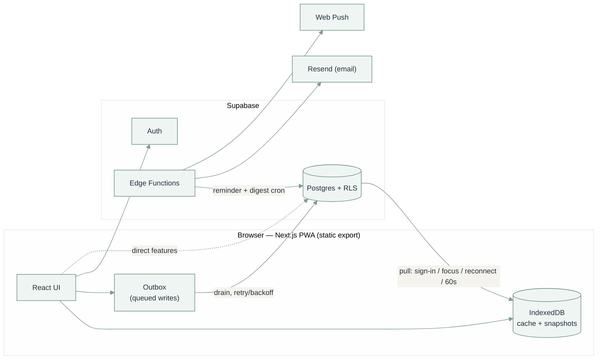

# Lauva

A personal health tracker: food, symptoms, supplements, habits, stool, workouts, cycle and coffee, plus dashboards to make sense of it. Live at **[lauva.pl](https://lauva.pl)**.

- Works fully offline, syncs to Supabase once you sign in
- Installs as a PWA on iPhone and Android, and works as a normal desktop site
- Designed to feel like a native iOS 26 app

---

## Contents

- [Pages](#pages)
- [How logging works](#how-logging-works)
- [Tech stack](#tech-stack)
- [Running it locally](#running-it-locally)
- [Project structure](#project-structure)
- [Architecture at a glance](#architecture-at-a-glance)
- [CI and deployment](#ci-and-deployment)
- [Maintainer notes](#maintainer-notes)
- [Further docs](#further-docs)

---

## Pages

Five main areas, in the phone tab bar and the desktop sidebar. Messages appears only once a partner is linked.

| Area | Route | What it's for |
|---|---|---|
| **Log** | `/log` | Tap-to-log for every tracking domain, plus a Summary of the day |
| **Agenda** | `/agenda` | One urgency-sorted list: reminders, expiring products, doctor follow-ups, appointments; a switcher narrows it to Mine, Shared, Expiry (grouped Today → This week → … → Next year) or Medical; a product is cleared as used up or thrown away from its sheet |
| **Trends** | `/analytics` | A dashboard per Log domain, plus Patterns |
| **Health** | `/medical` | Visits, lab Results, Vitals, Doctors |
| **Notes** | `/personal` | Journal, Wishlist, shared discount Codes |
| **Messages** | `/notes` | Private messages with a linked partner: Inbox, Sent, Favourites; reply to a specific message (long-press, or ↩ on hover) and it's quoted in your bubble; a conversation's ⋯ menu reminds your partner about a message they haven't read, or deletes it for both after a confirmation |

Secondary pages:

| Page | Route | Where it lives |
|---|---|---|
| Settings | `/manage` | Sidebar foot / phone menu. Every editable list and option in the app |
| Help | `/help` | Sidebar foot / phone menu. Searchable plain-language reference |
| Google Drive | `/my-drive` | Account menu. Read-only Drive browser |

Old routes redirect: `/overview` → `/agenda`, `/doctors` → `/medical`, `/home` → `/personal`.

### Log

Sections: **Food · Symptoms · Supplements · Habits · Stool · Workout · Cycle · Coffee · Summary**

#### Getting around

- **Phone:** Log opens on a list of your sections, each with the day's count (or the period day for Cycle), with Summary below it. "‹ Log", Back or an edge swipe returns to the list.
- **Desktop:** the sections are a tab row, with Summary as the last tab.
- Log reopens on whichever section you used last.
- **Deep links:** `/log/?tab=<section>` opens a section, e.g. `?tab=workout` or `?tab=summary`. Settings → Workout links back this way.
- **Toolbar:** search (or add), meal / time of day, time. On desktop it sits beside the page title.
- **Categories:** a scrolling rail on a phone, a sidebar with logged counts on desktop. They follow your order from Settings (A–Z until you set one); items inside are A–Z.

#### Food

- The current meal's foods sit above the list as removable chips ("Dinner · 3"). "Copy to…" logs them under another meal or day.
- **Usual:** what you log most at the chosen meal, most-logged first (the last 60 days count first).
- **In season** (under Usual): this month's in-season foods you haven't eaten lately; tap to log, × to hide.
- **Recipes** (a row under Usual, opens a sheet): tap one to log all its foods; ⓘ edits its foods, amounts (g, ml…), steps and rating.
- **Products:** log a whole product's ingredients in one tap.

#### Summary

- **Check-in** at the top: mood and energy, 1 (low) to 5 (high), each one row: name, stepped slider, and the chosen level named ("Unpleasant", "High"…), plus a wrapping note. Tap the current step again to clear it. On a phone it sits above the section list.
- A timeline of everything logged that day, coffee included (a cup opens the Coffee section).
- A meal is one row ("Dinner · 9 foods", its stars if rated). It opens a sheet to see its foods, rate it (1–5 stars), add a note or "Save as recipe".
- Other rows show the useful detail on the right: a symptom's intensity, the sleep band, a supplement's time of day. Tap any row to edit or delete it.

#### Workout

- A Log / Plan switch, with Charts (Trends → Workout) and Manage beside it.
- **Log:** every exercise by category, with a `− value +` stepper (drag or tap the number for fine steps).
- **Plan:** the day's targets from your active plans, and a week row showing done, missed or short days. Logging a plan set writes a normal workout log.
- Logging a timed or counted exercise that's already in today asks first, then adds onto that entry. kg sets stay separate.
- Tap a value in a row's "today" line to edit or delete it.
- **Apple Health:** an iOS Shortcut can send each day's walking minutes to Walking every evening (Settings → Workout → Apple Health). One entry per day; a re-run replaces it, and it replaces a walk typed in by hand that day. Log marks it "Apple Health".

#### Coffee

- Grouped by brand. Tapping a coffee opens a per-cup form: café, price, brewing, water temperature, tasting notes.

### Trends

One dashboard per Log section, plus Patterns. The time range sits in the title row and opens on the last 30 days; Patterns and Cycle read the whole history and have none.

| Dashboard | Shows |
|---|---|
| Food | Overview (meals a week against your food targets), Variety, Meal patterns, Combinations (including the combos you rate highest), Ingredients |
| Patterns | Symptoms, hard or loose stools (Bristol 1–2 / 5–7), low mood and low energy (a check-in of 1–2) that show up more or less often after a food or supplement, or in a cycle phase, tested for chance; a link's sheet compares how strong the symptom was (1–3) with and without the trigger; Compare picks any symptom and trigger from searchable lists |
| Supplements, Habits | A card per item with the days you logged it and consistency against its schedule; Sleep shades each day by hours slept and shows the typical band instead; archived ones list their course dates and consistency |
| Digestion | Every Bristol reading on a dot chart (hard / normal / loose counts under it), movements a day, symptom days against the previous period, each digestive symptom with its own day-by-day screen, what came with bowel movements, usual colour, hygiene and time |
| Workout | Each exercise first (latest value, change and a sparkline), then recent sessions and days trained per week (whole Monday–Sunday weeks); an exercise opens its per-session chart with best, average and last |
| Cycle | Current cycle day and the next period (or how late it is), average cycle, period and variation, every cycle as a history row, a length chart from three cycles, mood and energy per phase |

### Health

| Tab | Contents |
|---|---|
| Visits | Grouped lists: upcoming dates, decisions/notes/observations (filter by specialty), past visits with open follow-ups; each visit opens in a sheet |
| Results | Opens on the last blood test: markers out of range, back in range, or notably moved since the result before. Below it, every lab marker on a range bar (same band position on every row), value and unit in aligned columns, H/L flags. Tap one for an Apple Health-style trend (6M–All, drag to read a point, swipe through time) and its readings. A PL/EN switch shows panel and marker names in Polish or English |
| Vitals | Blood pressure (low readings marked, ACC/AHA categories) and weight, in the same trend card as Results; optional weight-goal band |
| Doctors | Read-only directory; editing is in Settings. Each doctor has a Visit summary (`/medical/summary/?doctor=<id>`): symptoms, blood results, vitals, supplements, that specialty's notes, open follow-ups and visits over 3, 6 or 12 months, ready to print or save as a PDF |

### Settings

A grouped list where each row opens its own screen. Everything editable in the app lives here.

| Group | What you can do |
|---|---|
| Tracking | Add, rename, archive or delete items and categories. Edit products, coffees and the Stool and Coffee option chips. Set food targets. Build workout plans |
| Health | Doctors, doctor types, lab markers and panels, the weight goal |
| Lists | Reminder lists and wishlist lists |
| App | Appearance, visible sections, usual meal times, data export and restore |

- **Order:** drag ≡ to reorder categories, sections, lists, doctor types, lab panels and option chips. Orders sync to every device.
- **Icons and colours:** ~1,900 searchable icons (Lauva's own plus [Lucide](https://lucide.dev)) and any colour via +. A picked colour is saved to **Your colours** and offered in every picker. Built-in categories start with their own icon; a new one gets its section's icon.
- **Food targets:** start from a diet (Everything, Pescatarian, Vegetarian, Vegan), then set each food group to at least / at most so many meals a week, or Off. Trends → Food measures against them.
- **Links in:** every Edit / Manage / Goal link elsewhere goes straight to its section, and to the doctor or list it came from (`settingsHref` → `/manage/?section=<title>&item=<id>`).
- **Food products** and **Workout plans** open from a row at the bottom of the Food and Workout screens.
- **Workout plans:** lifts with a starting weight and weekly gain, and which days get +kg or a % of that week's base.
- **Visible sections:** show or hide each Log section (also hides it on Trends and its rows in Settings), each with an optional daily "remind me to log" time.
- **Your data:** export the whole account (messages included) as JSON, or one section or everything as CSV.
- **Restore:** load a JSON export back in; it only adds rows that are missing and never changes or deletes anything.

---

## How logging works

- **Tap-only.** No forms on the tracking tabs: pick a category, tap an item.
- **Symptoms** cycle through intensity 1 → 2 → 3 → clear. **Sleep** takes a band (`<5h` … `9h+`).
- **A logged item** gets a filled circle with a tick (Reminders-style); a symptom's circle shows its level.
- **The day rolls over at 3 AM.** Anything logged before 3 AM counts toward the previous day.
- **The meal is auto-picked by time:** Breakfast before noon, Lunch before 6pm, Dinner after that.
- **Time is editable** per entry, and the date stepper opens a calendar.
- **Logging later uses the usual time.** Another meal, or a past day, starts at that meal's time from Settings → Usual times (Breakfast 08:00 … Dinner 19:00), never later than now. A symptom's sheet asks when it started.
- **Days before you start logging an item don't count against it.** A supplement or habit is measured from its first log; an archived one stops at its last log.
- **Supplements and habits can have a schedule:** every day (default), N× a week, or specific weekdays. Consistency on Trends is measured against it; days off the schedule and today (until logged) never count as misses.
- **A garnish isn't a serving.** Lemon, garlic, ginger, any juice or powder, breadcrumbs count toward variety but not toward food targets. In Settings, picking a group for one counts it, and "Garnish" marks any other food as one.
- **Sweets:** syrups, honey and milk chocolate count toward the Sweets & sugar limit; dark chocolate doesn't.
- **A day with no food logged never counts as zero.** Food targets and staples divide by the days with food logged in the range, not the calendar. A "vs previous period" figure only shows when both periods were logged on a similar number of days.
- **Patterns only compare days both sides were tracked.** A section counts as tracked from its first entry, on days you used the app, until it goes quiet for two weeks (a month for symptoms).
- **Patterns check foods and supplements within each cycle phase** once cycles are logged, so a food eaten mostly before a period doesn't take the blame for that phase's symptoms.
- **Cycle** stores only period days. Cycle length and predictions are always derived, never stored.
- **Cycle gaps:** one unlogged day inside a period is bridged. A cycle under 15 days or about twice the usual length looks like a missed log, so averages, variation, predictions and the length chart leave it out.
- **Hiding a section** in Settings hides it from both Log and Trends, on every device.

---

## Tech stack

| | |
|---|---|
| Framework | Next.js 16 (App Router, static export), React 19, TypeScript |
| Styling | Tailwind CSS 4, design tokens in `src/app/globals.css` |
| Backend | Supabase: Postgres, Auth, Row-Level Security, Edge Functions |
| Local store | IndexedDB (`idb`), a cache plus an offline write queue |
| Libraries | Recharts, react-markdown + remark-gfm, jszip |
| Tests | Vitest (+ `fake-indexeddb`, jsdom for components) |

---

## Running it locally

Needs **Node 24** (see `.nvmrc`).

```bash
npm install
npm run dev
```

Logging works straight away with no account. To sync across devices:

1. Create a Supabase project
2. Run [`supabase/schema.sql`](supabase/schema.sql) in its SQL editor
3. Copy `.env.local.example` to `.env.local` and fill it in
4. Sign in from the account menu

### Environment variables

All optional. Without them the app runs local-only.

| Variable | Enables |
|---|---|
| `NEXT_PUBLIC_SUPABASE_URL`, `NEXT_PUBLIC_SUPABASE_ANON_KEY` | Sync and sign-in |
| `NEXT_PUBLIC_VAPID_PUBLIC_KEY` | Push notifications (also needs `VAPID_PRIVATE_KEY` as a Supabase secret) |
| `NEXT_PUBLIC_GOOGLE_CLIENT_ID` | Google Drive |

### Commands

```bash
npm run dev         # dev server on :3000
npm run lint        # eslint
npm run typecheck   # tsc --noEmit
npm run test        # vitest
npm run build       # production build (also type-checks)
```

---

## Project structure

```
src/
  app/                one folder per page (App Router)
  components/         UI — ui/ holds the shared primitives
  lib/
    aggregations/     dashboard calculations, one module per dashboard
    db/indexedDb.ts   local cache, snapshots, write lock
    supabase/         client, sync, outbox, direct writes
    canonical/        items + logs → the shape dashboards read
  taxonomy/           categories, food classification, naming rules
supabase/
  schema.sql          full schema + RLS: the source of truth
  functions/          Edge Functions (cron, push, email, link titles, phone share)
  tests/rls.test.sql  RLS isolation tests (run in CI)
docs/
  architecture.md     sync, offline, data shapes, cron, email
  data-model.md       schema map with ER diagrams
  design-system.md    tokens, type scale, shared UI primitives
```

---

## Architecture at a glance


```mermaid
%%{init: {"theme": "base", "themeVariables": {
  "primaryColor": "#eef5f3", "primaryBorderColor": "#5c8a7a",
  "primaryTextColor": "#24313a", "lineColor": "#7d9a90",
  "fontFamily": "Inter, -apple-system, sans-serif", "fontSize": "14px"
}}}%%
flowchart LR
    subgraph browser["Browser — Next.js PWA (static export)"]
        ui["React UI"]
        idb[("IndexedDB<br/>cache + snapshots")]
        outbox["Outbox<br/>(queued writes)"]
        ui --> idb
        ui --> outbox
    end
    subgraph supa["Supabase"]
        pg[("Postgres + RLS")]
        auth["Auth"]
        ef["Edge Functions"]
    end
    outbox -->|"drain, retry/backoff"| pg
    pg -->|"pull: sign-in / focus / reconnect / 60s"| idb
    ui --> auth
    ui -.->|"direct features"| pg
    ef -->|"reminder + digest cron"| pg
    ef --> resend["Resend (email)"]
    ef --> push["Web Push"]
```

- **Supabase is the source of truth.** IndexedDB is only a cache.
- **Writes are local-first.** Each write lands in IndexedDB, then an outbox pushes it with retry.
- **Pulls happen** on sign-in, tab focus, reconnect and every 60 s. Unsynced writes are replayed on top, so they never vanish.
- **Every query filters by `user_id`,** and every foreign key between user tables is a composite `(user_id, id)`.
- **Sync problems are visible:** `SyncStatusBanner` for stuck writes, `StorageErrorBanner` for local storage failures.

Full detail: **[docs/architecture.md](docs/architecture.md)**.

---

## CI and deployment

| What | How |
|---|---|
| Checks | `check.yml`: lint, typecheck, test and build on every push, plus an RLS test job against a throwaway Postgres |
| App deploy | Push to `main` → `deploy.yml` → GitHub Pages at `lauva.pl`. **A push to `main` is a deploy.** |
| Edge Functions | `deploy-functions.yml` runs when `supabase/functions/` changes, and syncs their secrets |
| Version | Footer shows `v<major.minor>.<commit count>`, the commit hash and its date |

---

## Maintainer notes

- **Styling:** use the tokens (`var(--…)`) and the shared primitives in `src/components/ui/`. See [docs/design-system.md](docs/design-system.md).
- **Icons:** `public/icons/` are renders of `public/logo-mark.svg`. Regenerate them, don't hand-edit.
- **Password reset:** `https://lauva.pl/reset/` and `http://localhost:3000/reset/` must be listed in Supabase → Auth → Redirect URLs.
- **Google Drive:** needs an OAuth web client with `http://localhost:3000` authorized, the `drive.metadata.readonly` and `drive.file` scopes, and the Drive API enabled.
- **Email:** needs a verified Resend domain. See [docs/architecture.md](docs/architecture.md#email).
- **One partner per account,** by design. There's no in-app unlink yet.
- **Not in git:** `.next/`, `out/`, `data/`, `.claude/`.

---

## Further docs

| Doc | Covers |
|---|---|
| [docs/architecture.md](docs/architecture.md) | Sync, offline writes, data shapes, direct-to-Supabase features, PWA, cron, email |
| [docs/data-model.md](docs/data-model.md) | The database schema, with ER diagrams |
| [docs/design-system.md](docs/design-system.md) | Colours, type, and the shared UI components |

---

## License

All rights reserved. See [LICENSE](LICENSE). The source is visible for reference, not for reuse.
