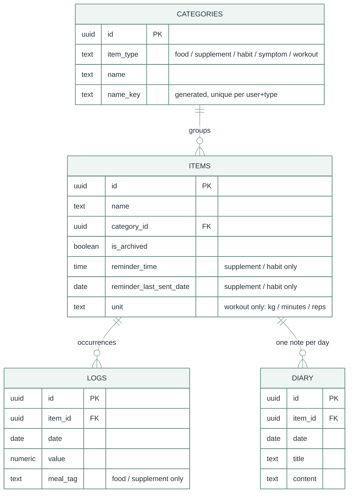
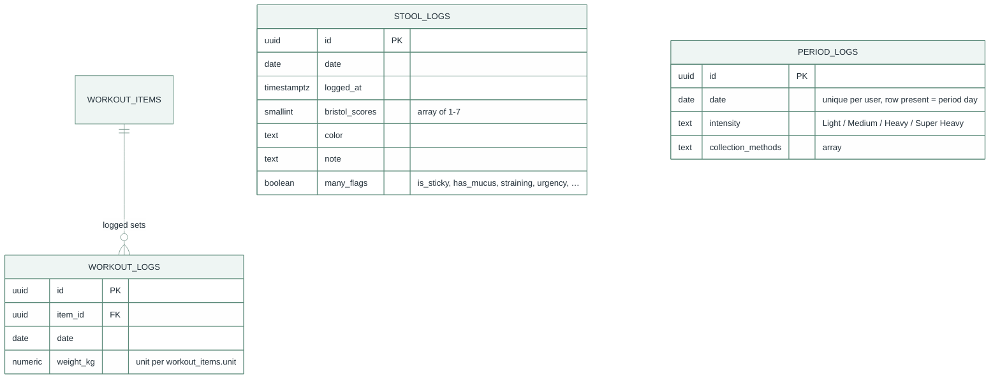
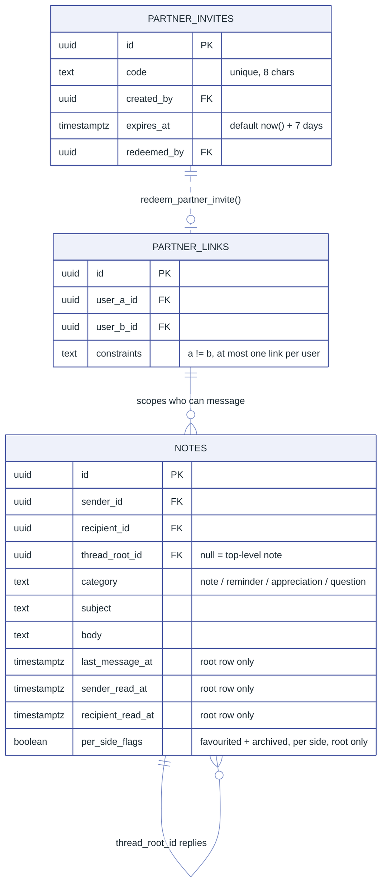
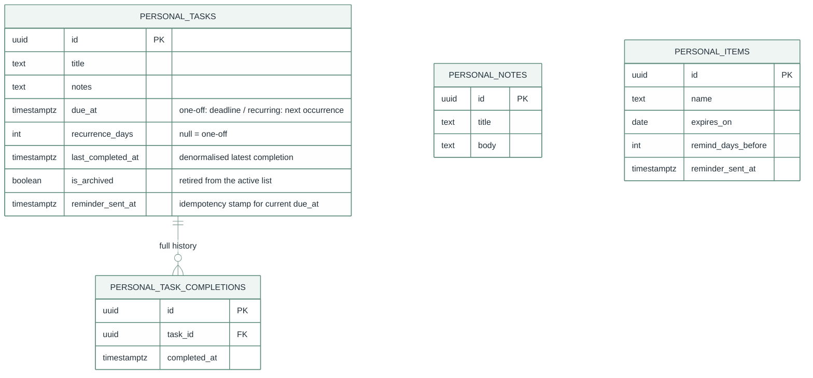
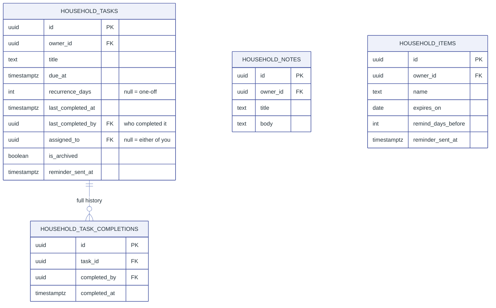

# Data model

Everything Lauva stores lives in one Supabase (Postgres) project.
[`supabase/schema.sql`](../supabase/schema.sql) is the authoritative
definition — full DDL, indexes, triggers, and RLS policies. This document
is the readable map of it: what the tables are, how they group, and how
they relate.

IndexedDB in the browser is only a synced cache of a subset of these
tables (the item/log/diary core). It holds no data that isn't in Supabase.

## Conventions

Every table follows the same rules unless noted otherwise:

- **`user_id` on every table**, `not null default auth.uid()` — the app
  never passes it on insert.
- **Row-level security on every table.** The default shape is
  `using (auth.uid() = user_id) with check (auth.uid() = user_id)` — a
  user only ever sees or writes their own rows. The exceptions (Connect,
  Home) are listed in [RLS shapes](#rls-shapes) below.
- **Composite foreign keys.** Every FK between user-owned tables is on
  `(user_id, id)`, not `id` alone, so a row structurally cannot reference
  another user's row even if RLS were misconfigured. Category FKs also
  carry `item_type`, so a supplement item can't point at a habit category.
- **`name_key`** — a generated `lower(trim(name))` column, used for
  case-insensitive uniqueness per user.
- **`on delete restrict`** on every `*_logs` / `*_diary` FK — an item with
  any history can only be archived (`is_archived`), never hard-deleted.
  Notes and tasks follow the same "archive, don't delete" rule.

## Tracked-domain core (Food, Supplement, Habit, Symptom, Workout)

One `*_items` table, one `*_logs` table, and one `*_diary` table per
tracked type, all pointing into a shared `categories` table. This is the
shape the browser cache mirrors and the analytics dashboards read.

`ITEMS` / `LOGS` / `DIARY` above stand for the five concrete tables each —
`food_items` … `workout_items`, `food_logs` … `symptom_logs`,
`food_diary` … `workout_diary`. They are structurally identical apart from
the type-specific columns called out in the diagram. Workout has an item
table and a diary table but its logs live in `workout_logs` (next
section), which stores a denormalised exercise name rather than only an
`item_id`.

## Standalone logs (Stool, Workout sets, Cycle)

These don't fit the item/log/diary shape — a bowel movement or a lift
isn't "an item plus an occurrence" — so each is its own flat table.

**Nothing about the cycle is stored** beyond the flagged period days.
Cycle length, current cycle day, period length, and next-period
predictions are all derived from `period_logs` dates at the app layer
([`src/lib/aggregations/cycle.ts`](../src/lib/aggregations/cycle.ts)),
using a recent-cycles window rather than all history.

## Connect → Notes

Private messages between two linked accounts. This is the only part of the
schema where one user's action creates or reads a row about another user,
so it leans on two `security definer` functions instead of ordinary
policies.

- A **reply is just another `notes` row** with `thread_root_id` set — no
  replies table. The `last_message_at` / `*_read_at` / `*_favourited` /
  `*_archived` columns are meaningful on the root row only; the
  `notes_touch_thread` trigger keeps them current as replies arrive, which
  is what makes a thread unread again for the other side without a
  read-receipt table.
- `notes_lock_identity_columns` (BEFORE UPDATE trigger) rejects any change
  to `sender_id` / `recipient_id` / `thread_root_id` after insert.
- `partner_links` has **no INSERT/UPDATE policy** — the only way a link is
  created is `redeem_partner_invite()`. Participants can SELECT their own
  link and DELETE it (unlink).

## Log → Notes / Reminders / Expiration (private)

The three private-organiser tabs after Journal on the Log page. One user,
standard owner-only RLS, written directly to Supabase (no offline/outbox).
The `/home` page has shared (partner) versions of all three — same
components, `household_*` tables (next section).

`recurrence_days` null → one-off task (`last_completed_at` set = done, shown
in a "Done" section). Set → recurring: `due_at` advances by
`recurrence_days` on every completion, `reminder_sent_at` clears so the next
occurrence reminds again, and the task never becomes permanently done.
`is_archived` moves a task into an "Archived" section without deleting its
history; "Undo" drops the newest completion row (and rewinds `due_at` for a
recurring task). `personal_notes` and `personal_items` have no
relationships — a title+body note, and a name+expiry-date product.

## Reminders → Home

The same three concepts, shared with a linked partner. Reuses Connect's
`partner_links` pairing via the `is_household_member(target_user_id)` SQL
helper — no separate "share" step, no FK to `partner_links`.

Same one-off-vs-recurring shape as Personal, plus `last_completed_by` /
`assigned_to` so the UI can show who did it and who it's for.
`household_items` is the product-expiration tracker — standalone, no
relationship to the others. All four tables use the pair RLS shape below.

## Infrastructure tables

| Table | Purpose |
|---|---|
| `push_subscriptions` | One row per user — the Web Push endpoint/keys/timezone for their last device that enabled notifications. Row present = enabled. Read by the reminder cron with the service-role key. |
| `journal_entries` | Log → Journal: a freeform diary (`date`, optional `title`, `body`). Unrelated to the per-item `*_diary` tables. Written directly to Supabase. |
| `notes_digest_state` | One row per user — `last_sent_date` for the daily unread-notes digest email. Written only by the cron (service role); a client only reads its own row. |

## RLS shapes

| Tables | `using` / `with check` |
|---|---|
| All tracked-domain, standalone-log, `personal_*`, and infra tables | `auth.uid() = user_id` (SELECT only for `notes_digest_state` — the cron does every write) |
| `partner_invites` | `auth.uid() = created_by` |
| `partner_links` | SELECT/DELETE only: `auth.uid() in (user_a_id, user_b_id)` — no INSERT/UPDATE (created via `redeem_partner_invite()`) |
| `notes` | SELECT/UPDATE: `auth.uid() in (sender_id, recipient_id)`. INSERT: must be yourself, to your actual linked partner, into a thread you're part of. No DELETE. |
| `household_notes` / `household_tasks` / `household_items` / `household_task_completions` | `auth.uid() = owner_id or is_household_member(owner_id)` — visible and editable by the creator and their one linked partner. INSERT must be as `owner_id = auth.uid()`. |

## Functions & triggers

| Name | Kind | Role |
|---|---|---|
| `redeem_partner_invite(text)` | `security definer` fn | Redeems an invite code → creates the `partner_links` row + marks the invite. Enforces every business rule (expired, already redeemed, own code, either side already linked). |
| `get_partner_email()` | `security definer` fn | Returns just the linked partner's email (the only identity Lauva has). `auth.users` isn't client-queryable otherwise. |
| `is_household_member(uuid)` | `security invoker` fn | True if the caller is linked to the given user via `partner_links`. Used in every Home RLS policy. |
| `notes_touch_thread()` | AFTER INSERT trigger | Keeps a thread root's `last_message_at` / `*_read_at` current on every insert into the thread. |
| `notes_lock_identity_columns()` | BEFORE UPDATE trigger | Rejects post-insert changes to `sender_id` / `recipient_id` / `thread_root_id`. |

Email goes out only from the `reminder-cron` Edge Function
(service role): due reminders, and a once-a-day unread-notes digest gated by
`notes_digest_state`. Notes no longer send a mail per message.

## Not in Postgres

- **Which tracked domains are visible** is a per-device localStorage
  preference ([`src/lib/visibleDomains.tsx`](../src/lib/visibleDomains.tsx)),
  deliberately not synced — "I don't track this" is a statement about the
  person using this device, not about the data.
- **The PWA app-shell cache** (`public/sw.js`) is separate from both
  Supabase and the IndexedDB data cache.
