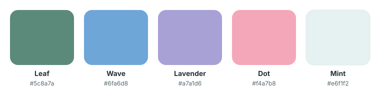

# Design system

Lauva aims to look like a native **iOS 26** app while still working as a normal desktop website. Everything below lives in `src/app/globals.css` and `src/components/ui/`.

---

## Colour

- **Tokens only.** Style with `var(--…)`, never hex literals
- `--brand-*` is the true Lauva palette (logo, large fills)
- The other tokens are deepened versions tuned for readable text and charts
- `--ui-accent` is the default interactive tint; each Log domain has its own `--series-*` colour
- `--text-muted` clears 4.5:1 on the page, cards and raised controls in every palette. Re-measure after changing any ground colour; never lighten it
- A user's own picked colour (`#rrggbb`) renders as picked, except in dark mode where one darker than `--custom-color-min-l` (oklch lightness 0.6) is lifted to it, hue kept (`customColorValue`)

### Themes

| | |
|---|---|
| Modes | Light / Dark / System, in Settings → Appearance (`src/lib/theme.ts`) |
| Palettes | Light: L1, L3 (default), L4, L5 · Dark: D1 (default), D2, D4 |
| Dark mode | A token-only override under `:root[data-theme="dark"]`; muted, never neon |
| Sync | The choice lives in the account's `user_preferences.prefs.appearance`, so every device follows it; localStorage caches it per device |
| First paint | A script in `layout.tsx` sets `data-theme` from that cache before render; `ThemeManager` applies the synced choice and follows the OS live |

---

## Type

One sans-serif family: SF Pro on Apple devices, Inter elsewhere (`--font-app`).

| Size | Use |
|---|---|
| 12px | Captions, section headers (uppercase, semibold) |
| 14px | Body, rows, chips, controls |
| 16px semibold | Sheet and form titles, alert buttons |
| 24px semibold | Page titles |

- Weights: 400, 500, 600 only. Never 700
- Inputs are 16px on phones so iOS doesn't zoom in
- Long text wraps, never overflows: `body` sets `text-wrap: pretty` + `overflow-wrap: break-word`, headings `balance`. Truncate only where a second line would break a fixed-height row

---

## Shape and surfaces

| Element | Radius | Surface |
|---|---|---|
| Toolbar controls, buttons, chips | 10px | `.control-surface`: white, hairline edge, soft shadow |
| Cards, grouped lists | 16px (`rounded-xl`) | White with a hairline border |
| Popover menus | 12px | `.menu-surface`: white, hairline edge, deeper shadow |
| Sheets | 20px | Grey plane; floats 8px in from the edges on phones |
| Alerts | 20px | `.menu-surface` |

- No full "pill" buttons. Controls and buttons stay at 10px
- No grey filled boxes for search or controls

---

## Page width

`ContentContainer` caps each page's width by type (Messages 2xl, Agenda 720px, Help 3xl, Log and Trends 6xl, everything else 4xl) but never centres it: every page starts at the same left edge beside the sidebar, so the title doesn't shift when switching pages.

## Components

### Navigation and switching

| Need | Use |
|---|---|
| Page-level view switch | `SegmentedTabs`: equal segments when they fit, overflow goes into "More" |
| Section or category switch | `TabRail` (underlined text tabs) |
| Two-way mode / chart window | `Segmented` |
| Rolling date window | `DateRangeFilter` (one popover, never a row of range pills) |
| Measurement chart period | `TrendCard`: 6M / 1Y / 2Y / 5Y / All, paged with ‹ › or a swipe |

### Controls

- **`CONTROL_CLS` / `CONTROL_STYLE`** (`ui/Chip.tsx`): search, menus, date stepper, Filter. 36px tall
- **Menus** show their value in the tint with an up/down chevron (`UpDownChevronIcon`)
- **`Chip`**: every selectable option. 32px, white at rest, tinted when on
- **`Button`**: `primary`, `tinted`, `outline`, `quiet`. Inline actions are plain tinted text, never a dotted underline

### Forms

- **`FormShell`** opens every add/edit form as a `Sheet` over the page it came from (Cancel left, title centred, Add/Done right; bottom sheet on phones, centred 448px panel on desktop) and holds **`FormGroup`** cards of **`Field`** rows. Delete on an edit sits in a red row at the end of the sheet
- **`SwitchRow`** for toggles
- **Explanations hide behind an ⓘ** (`InfoButton`): `CardTitle`'s `subtitle` and `FormGroup`'s `info` show it beside the heading. Keep the text to what isn't obvious from the controls
- **Numbers are picked, not typed.** In forms, a row shows the value on the right, and tapping it opens an iOS wheel under the row: `NumberWheel` (one column over a list of values), `KgWheels` (whole kg + quarter kg). `NumberStepper` (a raised −/+ capsule) is for quick inline adjustments
- **Summary rows open sheets:** a list of things to configure shows one row each (title, muted detail, value, chevron), and the detail is edited in a `Sheet`, not inline
- **Reorderable lists:** any list the user arranges has a ≡ grip at the row's end (`ReorderGrip` + `useManageOrder` in `components/manage/Reorder.tsx`, on `useDragReorder`). Drag it, or focus it and use the arrow keys. The order is saved account-wide (`usePreferences`) and applied in the data hook, so every screen showing the list follows it. Grips hide while a search filters the list
- **Formatted notes in a form** use `MarkdownField` with a `label`: a normal row in the card, with the formatting bar appearing under it only while you're writing
- **No boxed inputs**, never grey-filled
- **Dates and times:** `DatePicker`, `TimePicker`, `DateTimePicker`, `MonthPicker`. Never a native date input

### Dialogs

- **`AddMenu`:** "+ Add" for a section with more than one kind of thing to create (Agenda, Visits, Results) opens an iOS pull-down menu, not an inline picker card
- **`Sheet`:** every modal. A bottom sheet on phones (swipe down to close), centred from `sm`. Pass `form` for a create/edit/send form: the header becomes Cancel · title · action (Add, Done, Send) and there's no button at the bottom. Pass `back` for a screen pushed inside the sheet: the header becomes ‹ label · title · close. **`PickerList`** is that screen for choosing from a long list (search on top, A–Z groups, a tick on chosen rows; tap again to untick) — use it instead of a type-ahead when picking several things
- **`ConfirmDialog`:** the iOS-style alert behind every delete or discard (raised Cancel, red action when `destructive`). Never an inline Delete / Keep pair in the row. Portalled to `<body>`, so it opens cleanly from a sheet or swipe row
- **`DuplicateItemDialog`:** the same alert shape, for an item that already exists

### Lists

- **`.inset-rows`:** iOS grouped-list separators. Rows are at least 44px tall, with vertical padding so a wrapped two-line label still breathes
- **Multi-column lists** (Log items on desktop) size their columns with `fitColumnWidth` (`src/lib/fitColumnWidth.ts`): wide enough for the longest label, clamped 10–22rem, so long names don't wrap into slivers
- **`ListSection`:** the section header above a card
- **Time charts** (`components/charts/`): straight lines, a real time axis with horizontal labels from `windowAxis` (short months, month initials, then years — never rotated), the scale on the right, dots only on out-of-range readings and the latest one. Blue is low, red is high, green is the normal band. Measurement charts sit in `TrendCard` with a headline that shows the reading under your finger while you drag
- **Headline figures:** several stats go in `StatGrid` / `Stat` (`ui/StatGrid.tsx`): an aligned grid, two columns on a phone, each a small label above its number. `StatChip` is only for one figure inline in a sentence or card
- **Trends pages** are built from `analytics/TrendList.tsx`: `TrendGroup` (captioned inset card of rows), `TrendRow` (name left, one value right, optional thin bar under, chevron when it opens something), `SplitStatCard` (one card split into equal stat halves), `ComparisonRow` + `ComparisonKey` (previous period grey, now coloured, each with its count) and `ShowAllRow` (lists trim to 3 with "Show all N"). No prose summaries, no pills, no status words; bar colours come from the numbers shown (`--status-good` on target, `--status-warning` close, `--status-serious` well short)
- **Metadata** (kind, specialty, "shared") is plain text, not a badge
- **Row actions** (favourite, read/unread, edit, delete) sit behind a left swipe on a phone and appear on hover from `lg` (`useSwipeReveal`), not as icons on every row
- **Conversations** (Messages) follow iMessage: received bubbles left, yours right, a centred time over each burst, and the reply bar pinned to the bottom above the tab bar

---

## Accessibility floor

- Every tap target is at least **44px** (`.hit-slop`, `.tap-target`)
- Keyboard focus shows a 2px accent ring (`:focus-visible`); borderless text rows in a form group (`ROW_TEXT_CLS`/`ROW_INLINE_CLS`, tagged `.row-control`) show only the caret, no box
- Text on a solid accent fill (any accent, not just `--ui-accent`) uses `--on-accent`: white in light mode, near-black in dark, where the accents are lighter. A partial fill (55–80%) uses `--on-accent-mid`
- Chart normal/optimal bands use `--band-good` / `--band-good-strong`, stronger in dark mode
- Soft accent fills (icon tiles, selected rows, tinted buttons) mix the accent at `--tint-pct` (14% light, 24% dark): `color-mix(in oklab, <accent> var(--tint-pct), transparent)`
- Motion respects `prefers-reduced-motion`

---

## Assets

- `public/icons/` are PNG renders of `public/logo-mark.svg`. Regenerate them, don't hand-edit
